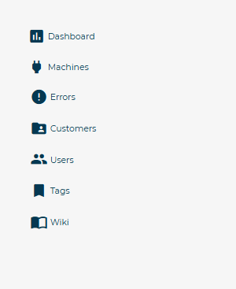
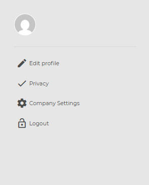

# Navigation Menu Structure

The **main menu** is located on the left side of the **CARIcare** platform interface.
It provides direct access to the main operational areas and remains visible throughout navigation.
The structure is divided into three functional areas: **header**, **navigation**, and **user profile**.

---

## Header

At the top of the menu are the **CARIcare logo** and the **notification bell icon**.

<kbd></kbd>

### CARIcare Logo

The logo, positioned at the center of the header, serves as a quick link to the **Dashboard**.
By clicking the icon, the user is automatically redirected to the platform’s home page.

### Notifications

The bell icon indicates the presence of new notifications related to system activities or events.
When a red indicator is visible, it means there are unread notifications.
Selecting the icon opens a list of recent communications (e.g., machine errors or completed operations).

---

## Navigation Section

The central part of the menu contains the main items for managing operational activities.
Each item is accompanied by a representative icon and a text label.

<kbd></kbd>

### Dashboard

Displays a general overview of key data, such as machine status and operational statistics.

### Machines

Allows consultation of the list of connected machines and access to the technical details of each device.

### Tickets

Contains all active and closed support tickets.
From this section, new tickets can be created or existing ones updated.

### Errors

Displays the list of errors recorded by the machines, with the ability to filter and analyze their causes.

### Customers

Manages customer records associated with the company account.

### Users

Enables management of user profiles, roles, and related access permissions.

### Tags

Displays configured tags used for classifying machines or components.

### Wiki

Opens the **CARIcare Wiki** technical documentation, useful for consulting guides and operational procedures.

---

## User Profile Section

The lower part of the side menu contains the functions associated with the personal account.

<kbd></kbd>

### Edit Profile

Allows updating of personal information and login credentials.

### Privacy Policy

Displays information regarding the processing of personal data.

### Company Settings

Shows the Service Vea Group contact reference.

### Log Out

Performs disconnection from the platform and ends the current session.
