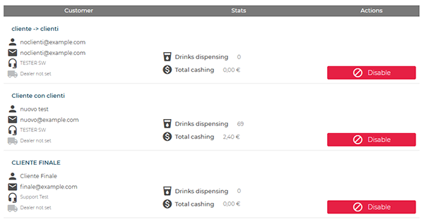

# Customers

The **Customers** section allows users to **view**, **add**, and **disable** associated customers.

<kbd></kbd>

## Overview

* **Filters**: *Customer*, *Administrator*, *Email*.

<kbd></kbd>

* **Export**: **CSV** button to download the displayed list.

<kbd></kbd>

* **Customer table**:

<kbd></kbd>

* **Customer**: company name, contact person, email, and type (e.g., reseller / not associated).
* **Stats**: **Drinks dispensing** and **Total cashing**.
* **Actions**: **Disable** button.

## Disabling a customer

To deactivate a customer, use **Disable** in the list.

<kbd></kbd>

## Adding a new customer

To create a new customer, select **Add new**.

<kbd></kbd>

In the **Add customer** page, complete the following fields:

<kbd></kbd>

1. **Name**
2. **Email**
3. **User type**:

   * **Customer** – authorized to create and manage their own customers
   * **End Customer** – limited access, cannot have customers
4. **Support user** – reference contact for service support
5. **Activation email** (optional – if selected, access credentials are automatically sent via email)

Confirm by selecting **Save**.

## Set customer

By clicking on the name of an existing customer in the list, the **Set customer** window opens, allowing the user to **update associated data** and **manage linked machines**.

<kbd></kbd>

In this screen it is possible to:

* **Edit** fields such as *Name*, *User type*, *Support user*, or add a *Note*.
* **View** the machines linked to the customer, including relevant details (machine name, serial number, firmware status).
* **Enable** the *Show advanced machine options* checkbox to quickly perform operations such as assigning a support user or recalling a specific machine.

When one or more machines are selected, additional actions become available:

<kbd></kbd>

* **Recall** – transfers one or more machines under the direct management of your account.
* **Assign support user** – assigns one or more selected machines to a support user.
* **Tag** – adds, edits, or removes identification labels associated with the machines.

Select **Proceed** to apply changes to the selected machines, or **Cancel** to discard operations.
