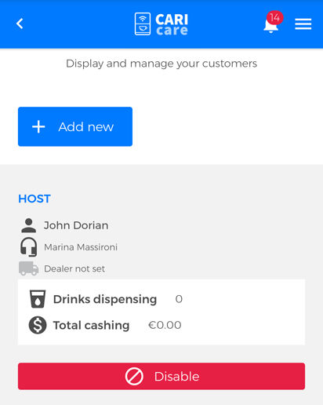

# Manage Customers

In this section You can **display**, **add** or **disable** customers.

## Add new Customer

In order **to add a new customer** click **"Add new"** button. 

<kbd></kbd>

On the "" fill in the fields **"name"** and **"email"**. Choose a technical support to assign to customer by selecting from "" drop-down menu.

Nella pagina "Aggiungi cliente/Crea cliente collegato a te" completa i campi **"nome"** ed **"email"**. Scegli un supporto da assegnare al cliente, selezionandolo dal menù a tendina **"supporto utente"**; *inserire parte su utente distributore*. 
Premi "Salva" per memorizzare i dati inseriti.

<kbd></kbd>

## Disable Customer

If you want to disable a customer click "Disable" button.

<kbd></kbd>
 

