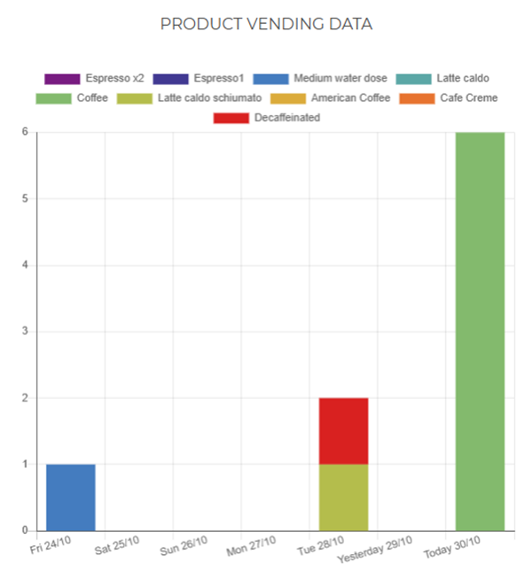

# Dashboard

**Dashboard** allows you to get **an overview on the state of your machines**, on **the relationship between your installed and recalled machines** and on **the product vending data**.

## The state of your machines

The **"state of your machines"** dashboard section shows **the total number of your machines**, **the number of encountered problems** including **"critical"**, **"warning"**, **"refill"** errors and **the number of disconnected machines**.

<kbd></kbd>

By clicking one of **"error panes"**, you access the **Errors** section (for further details see [**"Errors"**](https://carimali.github.io/wiki/#/docs-en/errori) ); at the top of the page, you can find a tab for each error type.

<kbd></kbd>

     
## Installed/recalled machines
 
The second dashboard section shows the graph relative to the number of **Installed/recalled machines** in the last year, displayed in two different colours.
 
 <kbd></kbd>
 
 **Please note:** this graph is particurly useful to get a glance on the relationship between the two types of machines.
 
 

## The product vending data
 
The third dashboard section includes **the graph relative to the product vending data** that shows **the sold products of your machines in the last seven days**. Every type of product is marked with a different colour. 
 
 
By clicking on each column, you can view **the detail of the single product** sold on any given day.
 
 <kbd></kbd>
 
By clicking on each product of the legend, you can remove it from the current view.

 <kbd></kbd> 
