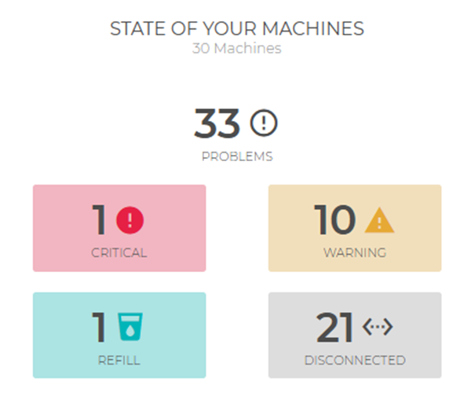

# Dashboard

The **Dashboard** provides a **comprehensive and up-to-date overview** of the machine status, the ratio between **installed and recalled units**, and **products sold**.
Information is displayed through graphical sections that allow immediate monitoring of operational performance and potential anomalies.

---

## Machine Status

The first section shows **the overall status of the machines connected to the platform**.
It displays the **total number of machines**, the **count of detected anomalies**, and their classification by type:

* **Critical**
* **Warning**
* **Refill**
* **Disconnected**

Each category is represented by a dedicated **status box**.

<kbd></kbd>

By selecting a status box, the user is redirected to the **Errors** section for a detailed review of anomalies (see the [**Errors**](https://carimali.github.io/wiki/#/docs-en/errors) page for more information).
In this section, the different error types are organized into dedicated tabs.

---

## Installed and Recalled Machines

The second section displays the **chart of installed and recalled (uninstalled) machines**.
The chart shows, using two different colors, the **number of units installed and recalled over the past twelve months**.

<kbd></kbd>

**Note:** this chart allows quick analysis of the **ratio between installations and recalls**, providing an immediate indication of the machine fleet’s evolution.

---

## Products Sold

The third section displays the **products sold chart**, which summarizes the **total sales recorded by the machines over the last seven days**.
Each product type is represented by a distinct color for a quick and intuitive reading.

By selecting a single column in the chart, the **details of the products sold** on that specific day are shown.

<kbd></kbd>

It is also possible to **exclude a product** from the visualization by selecting or deselecting it in the legend.

<kbd></kbd>

---

## Revenue Counter

The final section of the **Dashboard** displays the **revenue counter chart**, which represents the total income generated by the machines over a defined period.
Data is shown using **vertical bars**, each corresponding to a specific day.

The horizontal axis shows the **reference days**, while the vertical axis displays the **collected amounts**.
The uniform color of the bars allows easy identification of daily revenue trends and any significant variations.

<kbd></kbd>

By clicking on a single bar, the **details of the revenues for the selected day** are displayed.
This chart provides a clear and immediate view of the economic performance of the machines connected to the **CARIcare** platform.
