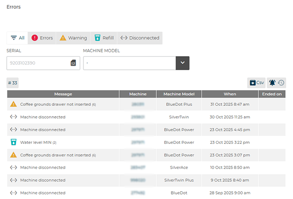
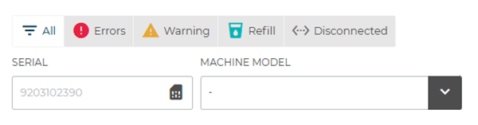
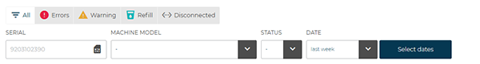
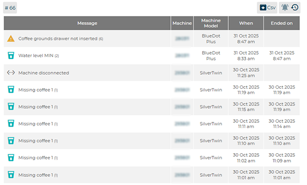

# Errors

The **Errors** section allows users to view and manage in detail all **anomalies detected on machines connected to the CARIcare platform**.
For each error, the **machine serial number**, **type of anomaly**, **machine model**, and **date or time of detection** are displayed.
For example, the symbol **<...>** indicates that the machine is **disconnected**.

<kbd></kbd>

---

## Filters and Search Functions

At the top of the screen, several filter tools are available to **organize and analyze the recorded errors**.

* **Error Type Filter Boxes:** allow selection of the category of error to display:

  * **All** (complete list)
  * **Errors** (critical)
  * **Warning** (alerts)
  * **Refill** (product shortages)
  * **Disconnected** (machines not connected)

<kbd></kbd>

* **Serial:** filters errors based on the **machine serial number**.
* **Machine Model:** filters results according to the **models in the user’s fleet** (e.g., *BlueDot*, *SilverTwin*, *Armonia*).
* **#33:** indicates the **number of detected errors**.
* **CSV:** allows **export of error data** into a **.csv file** for external analysis or archiving.

<kbd></kbd>

---

## Alarm Display Modes

Alarms can be displayed in **two different modes**:

 displays **all active alarms** in real time, without time limits.
This mode allows monitoring of the current machine status and enables prompt action on ongoing anomalies.

<kbd></kbd>

 opens the **alarm history**, which also includes **resolved or closed errors**.
Within the history, additional **advanced filters** are available:

* **Status:** distinguishes between **open** (pending) and **closed** (resolved) alarms.
* **Date:** filters events by period, allowing selection among:

  * **Last week**
  * **Last two weeks**
  * **Last month**
  * **Last three months**

<kbd></kbd>

These two modes provide a comprehensive and dynamic view of the operational status of the machines, allowing quick switching between real-time monitoring and historical anomaly analysis.

 exports the error history in CSV format.

---

## Error Table

The lower part of the screen presents a **summary table** that shows, for each recorded error:

* **Message:** brief description of the anomaly (e.g., *Check water level*).
* **Machine:** identifying serial number of the machine.
* **machine Model:** model of the affected machine.
* **When:** date and time of detection.
* **Ended on:** date and time of resolution (if available).

This table allows **monitoring of the operational status of the machines** and **tracking of the complete history of anomalies** recorded on the platform.

<kbd></kbd>

---

## Link to the “Machine status” Page

By selecting the **machine serial number** in the table, the system automatically opens the corresponding **Machine Details** page.
From this section, it is possible to review all **events, alarms, and operational data** associated with that machine for technical analysis or in-depth verification.

<kbd></kbd>
