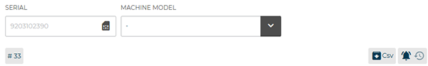

# Error Messages

**Errors section** shows you the errors on the machine. 
An error message contains **the machine number**, **the error type** (eg. the "<...>" symbol indicates that machine is disconnected) and **when it occured**.

<kbd></kbd>

You can choose to display all errors or just a type of error by clicking the respective symbol in the top bar.

<kbd></kbd>

## Error Reporting

In order **to report an error**, click **"create ticket"** button to access the **error reporting** page.

<kbd></kbd>

The ticket shows **the support name**, **the error topic** and **the creation date** of the ticket.

<kbd></kbd>

By clicking the **"Options"** button you can view the pane of the machine model to be reported.

