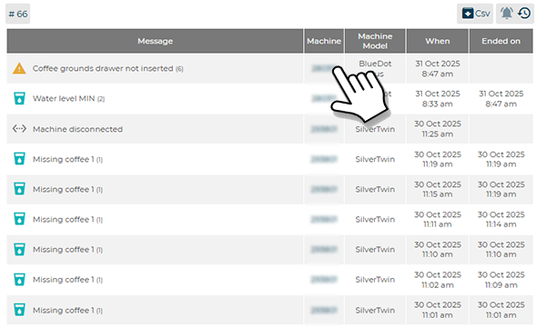

# Error Display

The **Errors** section allows detailed visualization and management of all **anomalies detected on machines connected to the CARIcare platform**.
For each error, the **machine serial number**, **type of anomaly**, **machine model**, and **date/time of detection** are displayed.
For example, the symbol **<...>** indicates that the machine is **disconnected**.

<kbd></kbd>

---

## Filters and Search Functions

At the top of the screen, several filter tools are available to **organize and analyze the recorded errors**.

* **Error Type Filter Boxes:** allow selection of the error category to display:

  * **All** (complete list)
  * **Errors** (critical)
  * **Warnings** (alerts)
  * **Refill** (product shortages)
  * **Disconnected** (offline machines)

<kbd></kbd>

* **Serial:** filters errors based on the **machine serial number**.
* **Model:** filters results according to **machine models in the fleet** (e.g., *BlueDot*, *SilverTwin*, *Armonia*).
* **#34:** indicates the **number of errors**.
* **CSV:** allows **export of error data** into a **.csv file** for external analysis or archiving.

<kbd></kbd>

---

## Alarm Display Modes

Alarms can be viewed in **two different modes**:

 displays **all active alarms** in real time, without time limits.
This mode allows monitoring of the current machine status and prompt intervention in ongoing anomalies.

<kbd></kbd>

 opens the **alarm history**, which also includes **resolved or completed errors**.
Within the history, additional **advanced filters** are available:

* **Status:** distinguishes between **open** (unresolved) and **closed** (resolved) alarms.
* **Date:** filters events by period, selecting from:

  * **Last week**
  * **Last two weeks**
  * **Last month**
  * **Last three months**

<kbd></kbd>

These two modes provide a complete and dynamic overview of the machines’ operational status, enabling quick transition from real-time monitoring to historical anomaly analysis.

 exports the error history in CSV format.

---

## Error Table

The lower part of the screen contains a **summary table** displaying, for each recorded error:

* **Message:** brief description of the anomaly (e.g., *Check water level*).
* **Machine:** identifying serial number of the machine.
* **Model:** machine model involved.
* **When:** date and time of detection.
* **Ended on:** date and time of closure (if available).

This table enables users to **monitor the operational status of machines** and **track the complete history of anomalies** recorded within the platform.

<kbd></kbd>

---

## Link to the “Machine Details” Page

By selecting the **machine serial number** in the table, the system automatically opens the **Machine Details** page for that unit.
From this section, users can view all related **events, alarms, and operational data** for technical analysis or detailed verification.

<kbd></kbd>
