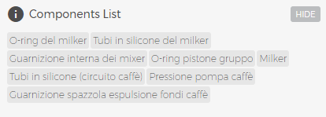

# Machine status

Access this section by clicking inside the machine pane:

<kbd></kbd>

From this point forward, all the information displayed will be strictly related to the selected machine.
In this section you also find the following pages:

## Maintenance

<kbd></kbd>

In this purely informational section you can get:

- How long it is until **scheduled maintenance** (Quarterly/Yearly). Maintenance time changes according the model and it refers to that specified in the product manual. A progress bar with different colours (green, yellow, red) will be filled, day after day, starting from "day one" until recommended time has elapsed; at which point, it will be sent a **"maintenance required"** notification email to technical support.     

<kbd></kbd>

Click "show" button below each progress bar to view which components should be replaced during maintenance.

<kbd></kbd>

- **the number of cycles performed by head group express**. A progress bar with different colours (green, yellow, red) shows the wear status of all components. Once the component will have reached the maximum number of cycles, it will have to be replaced and a **"verify group"** notification email will be sent to technical support.  

<kbd></kbd>

- **The number of product disbursements** in last 24 hours of the maximum recommended daily. This is to make it clear if a coffee machine is used beyond its means, to avoid the loss of quality of products and rapid deterioration or to prevent the breaking of components.

- **the graph relative to the product vending data** that shows the sold products of your machines in the last seven days.

 <kbd></kbd>

- **Drink Dispensing**. Click **"Show"** to display the disbursements for each drink.

<kbd></kbd>

- **Cleaning Cycles**.

<kbd></kbd>

- **Total Cashing**.

     
 ## Recipes
 
 <kbd></kbd>
 
 In this section you can:
 
 - **Import/Export a recipes set**. Click **"Save a recipes set"** to add the set at the moment on the machine, in the **Import a recipe set** drop-down list. 
 
 
 <kbd></kbd>

You can choose a set from the **Import a recipe set** drop-down list in order to load it in the coffe machine.

 <kbd></kbd>

**Please Note**: all your group with proper credentials can view all the recipes. 

- **View/Edit the recipes status**. You can also enable/disable the recipe, change the icon and, if provided for in machine configuration, the price and the type of glass;
Click a recipe to access the configuration.

<kbd></kbd>

Click a recipe to modify it: you can update every single parameter just as if you were right in front of your coffee machine! For a detailed explanation of how to configure the machine, please refer to user manual. Click **"Save"** to keep your changes: otherwise, all changes will be lost.

 
 ## Settings
 
 <kbd></kbd>
 
  In this section you can:
  
  - **change the machine language**. Select the language from the **Primary language** drop-down list.
 If required by model, you can also modify **the secondary language**;    
 
   <kbd></kbd>
   
  - **set the Coffee Threshold Alarm**. This feature allows to assign an amount of coffee to each machine nad to receive two email notifications: the first one is when coffe consumption is about to reach the fixed quantity **Coffee Threshold (%)**; the second one is when **the coffe quantity (KG)** is completely consumed.
 After setting up the parameters, click **"Coffe Threshold Alarm"** to enable the feature.
  
<kbd></kbd> 

**Please Note**: once the feature is enabled, the parameters can no longer be edited until the amount of coffee will be completely consumed.

