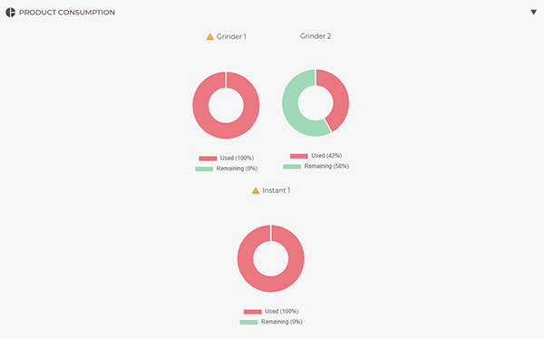
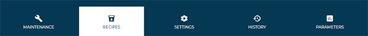
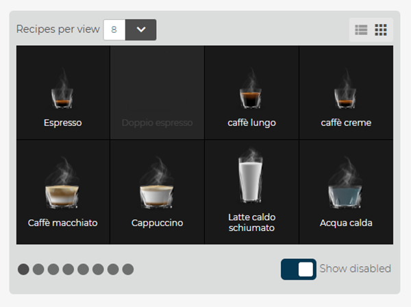
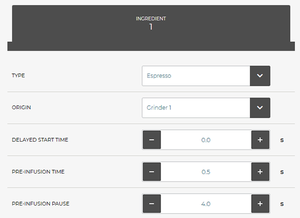
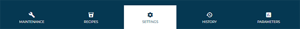
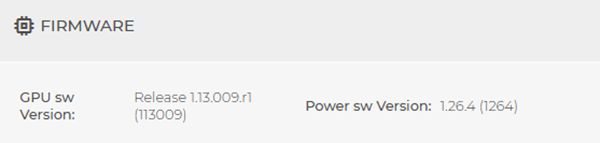
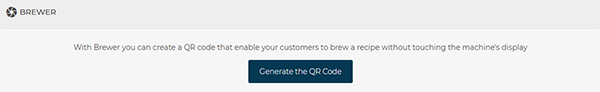
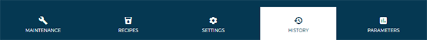

# Machine Status

The **Machine Status** section allows viewing all operational information related to a single machine connected to **CARIcare**.

To access the section, select the  tile corresponding to the desired machine.

<kbd></kbd>

From this point on, all displayed data refer exclusively to the selected machine.
The interface is composed of three main tabs:

* **Maintenance**
* **Recipes**
* **Settings**
* **History**
* **Parameters** (SilverAce line only with the latest firmware version)

---

## Maintenance

<kbd></kbd>

The **Maintenance** tab reports the statistical and non-sales information of the machine as detailed below.

### Dispensing

The **Dispensing** module enables detailed analysis of the dispensing activity of the selected machine.
Data are presented graphically to facilitate monitoring of beverages dispensed over a given period.

<kbd></kbd>

#### Module structure

The module consists of three main sections:

* **Time and selection filters**
* **Dispensing chart**
* **Export tools**

#### Time and selection filters

At the top, fields are available to set the period and analysis criteria:

* **Time range**
  Allows selection of the period to analyze (last week, last two weeks, last month, etc.).
  The **selection filter** allows data visualization up to a maximum of **one year prior** to the current date.
  The filter is applied to the chart automatically after selecting **Choose dates**.

* **Select recipes**
  Limits the view to one or more specific recipes available on the machine.

* **Dispense type**
  Filters by *online* and *offline* dispensing.

#### Dispensing charts

The **Dispensing** module presents two complementary charts that show the same information on different time scales, enabling comprehensive analysis of the machine’s activity.

**Chart 1**

Represents the total number of beverages dispensed per day within the selected period.
Each column indicates a time reference, while colors identify different recipes.

<kbd></kbd>

**Chart 2**

Shows the distribution of beverages dispensed across the different hours of the day.
Each column represents one hour (from 00:00 to 23:00), while color segmentation distinguishes the dispensed recipes.

<kbd></kbd>

This chart enables:

* Identification of **peak usage time slots** for the machine.
* Analysis of **consumption peaks** in relation to the type of beverage dispensed.
* More efficient planning of **maintenance** or **refills** based on peak operational hours.

#### Export and analysis tools

Below **Chart 1** there are three function buttons:

* **Group by recipes**
  Reorganizes the chart and displayed data by showing dispensing aggregated by recipe rather than by date.

* **Export dispensing data to CSV**
  Generates a **CSV** file containing the detailed dispensing data.
  The file can be used for statistical analysis or integration with external management systems.

* **Export counters to CSV**
  Creates a **CSV** file with the machine’s partial counters for the selected period.

---

### Temperatures

<kbd></kbd>

The **Temperatures** module shows the temperatures detected by the machine’s sensors:

* **Coffee** – Coffee boiler temperature.
* **Steam** – Steam boiler temperature.

Information is updated periodically and allows verification of the system’s thermal stability.
An anomalous value may indicate a malfunction in the brew group or the heating circuit.

---

### Drinks Dispensing

<kbd></kbd>

The **Dispensing** module displays data related to the number of beverages distributed:

* **Global Counter** – Total number of dispenses performed by the machine (non-resettable).
* **Partial Counter** – Number of dispenses recorded since the last reset. Data are updated at regular one-hour intervals.

Selecting **Show** displays a complete breakdown of dispenses by individual beverage.

---

### Washing Cycles

<kbd></kbd>

The **Washing Cycles** module reports the number of wash cycles performed by the various machine components:

* **All in One** – Total number of full cycles.
* **Group** – Wash cycles performed on the coffee group.
* **Milker** – Wash cycles for the milk system.
* **Mixer** – Wash cycles for internal mixers.

This information enables monitoring of correct execution of routine cleaning.

---

### Calibrations

<kbd></kbd>

The **Calibrations** module shows the calibration values for the machine’s dosers:

* **Grinder 1 / 2** – Coffee quantity (*g/s*).
* **Soluble 1** – Product quantity (*g/s*).

> **Note:** this section is **visible only when a super-automatic machine is selected**

---

### Map and address

<kbd></kbd>

The **Map and address** module shows the **geographical location of the machine** displayed in the status tab.
The area uses **Google Maps** integration to provide a precise and interactive location of the installation point.

The map can be viewed in two modes:

* **Map** – Displays the standard view with roads, places, and main references.
* **Satellite** – Displays the satellite view with real imagery.

Below the map, the **full installation address** is shown, including street, street number, city, and postal code.
The **Navigate** button opens the location directly in the device’s default navigation application.

Selecting **Change address** allows updating the location associated with the machine, for example in case of relocation or new installation.
The update is saved automatically on the platform and reflected on the map in real time.

---

### Quarterly maintenance

<kbd></kbd>

The **Quarterly maintenance** module shows the remaining time before the periodic maintenance intervention.
The progress bar represents the elapsed days relative to the reference period (90 days).

* **Everything is OK**: the machine is within the safe operating period.
* **Remaining days**: indicates the number of days before the next scheduled check-up.
* **Reset counter**: resets the counter after maintenance has been performed.

  > This action is not reversible.

The next intervention is automatically scheduled based on the date shown next to the status bar.

---

### Yearly maintenance

<kbd></kbd>

The **Annual maintenance** module follows the same principle as the quarterly maintenance, but refers to the periodic check on an annual basis (365 days).
It shows the **date of the next check-up**, the **remaining days**, and the **time progress bar** that indicates the completion level of the operating period.

Here too, the **Reset counter** button must be used at the end of the intervention to restart the monitoring cycle.

---

### Cycles components

<kbd></kbd>

The **Number of cycles** module tracks the overall number of **dispense cycles performed by the coffee group**.
The progress bar shows the number of cycles performed against the planned maintenance threshold.

* **Remaining cycles**: indicates how many cycles remain before reaching the set limit (e.g., 50,000).
* Once the threshold is exceeded, the machine requires a check of the brewing group or replacement of wear components.

---

### Product disbursements in the last 24 hours

<kbd></kbd>

The **Dispensing in the last 24 hours** module compares the number of beverages actually dispensed with the **recommended daily maximum limit**.
The ratio is shown both numerically (e.g., 108/200) and by a progress bar.

This module enables monitoring of the machine’s **daily usage level** and identification of potential **operational overloads** that could compromise beverage quality or reduce component lifespan.

---

### Product consumption

The **Product consumption** module displays the utilization level of the products dispensed by the machine (coffee beans and soluble products).
Data are shown via **donut charts**, highlighting the **used percentage** and the **remaining percentage** for each container.

<kbd></kbd>

The number of displayed charts varies according to the number of grinders and mixers installed on the machine.

* **Grinder 1 / Grinder 2** – Indicate the amount of coffee beans used by each grinder.
* **Soluble 1** – Indicates the amount of soluble product (e.g., chocolate or milk powder) consumed.

The legend below each chart clearly distinguishes:

* **Used (in red)** – Percentage of product already consumed.
* **Remaining (in green)** – Percentage of product still available.

An **orange warning triangle** next to the component name indicates that the relevant counter has reached or exceeded the set limit.
In this case, a **counter reset** is required.

#### Counter reset

Selecting the **warning icon (orange triangle)** next to a component opens a confirmation window to **reset all product consumption counters**.

<kbd></kbd>

By selecting **Confirm**, the system resets the consumption values and restarts counting for subsequent cycles.
The **Cancel** button allows aborting the operation without making changes.

> **Note:** this section is **visible only when a super-automatic machine is selected** (currently SilverAce and SilverTwin line with the latest firmware).

> ⚠️ **Warning:** counter reset is a permanent action and cannot be undone.
> It is recommended to perform it only after the actual product refill.

---

## Recipes

<kbd></kbd>

The **Recipes** tab allows managing the recipes installed on the machine, editing dispensing parameters, storing or recalling configurations, and sending changes directly to the connected device.

### Menu structure

The top area shows the selected machine and the **Import a recipe set** dropdown menu, from which a previously saved set for the same machine model can be loaded.

<kbd></kbd>

Below, a window shows the **available recipes** (*enabled* and *disabled*), which can be displayed in two modes:

* **Grid view**: graphical previews of beverages; corresponds to the machine’s end-user view.

SilverAce & SilverTwin line:

<kbd></kbd>

Evok:

<kbd></kbd>

* **List view**: ordered textual display.

<kbd></kbd>

It is possible to define the **number of recipes per page** (in *grid* view) and select a specific beverage to edit its parameters.

The **Show disabled** option allows displaying recipes that are temporarily not enabled.

### General recipe parameters

The upper part of the configuration tab contains the **parameters common to all recipes**, regardless of beverage type or machine model.

<kbd></kbd>

* **Label**
  Indicates the **display name** of the beverage in the machine menu.
  It can be freely edited to suit the language or customer nomenclature (e.g., *Short espresso*, *Double espresso*, *Hot milk*).

* **Enabled / Disabled**
  Defines whether the recipe is **active** and therefore visible to the user on the machine.
  Disabled recipes remain saved in the system but do not appear in the machine’s main menu.

* **Icon**
  Allows selection of the beverage’s **representative image** from those available.
  The chosen icon will be displayed on the machine’s screen or in the portal’s recipes view.

* **Number of products**
  Specifies the **number of ingredients or components** involved in the recipe (e.g., coffee + milk, coffee + chocolate).
  The set value affects subsequent parameters, which will vary according to the number of selected products.

### Recipe-specific parameters

The lower part of the configuration tab contains the **specific parameters**, which vary according to the **selected product type**.

<kbd></kbd>

These parameters define the **technical dispensing behavior** and the **operational characteristics** of the individual ingredient (e.g., milk, coffee, or soluble products).
Each product has a dedicated set of entries.

The configured values determine the **machine’s work sequences** during beverage preparation and directly affect the **final quality of the dispensed product**.

> **Note:** the structure and number of displayed parameters depend on the machine type and selected product.
> For a detailed description of each field, refer to the **model’s technical manual**.

Changes can be applied directly from the panel and are equivalent to those that can be made on the physical machine.
At the end of configuration, **save or send the changes** using the buttons at the bottom.

### Available operations

<kbd></kbd>

* **Save a recipes set**
  Stores the currently configured recipe set and adds it to the list available in the **Import recipe set** menu.

* **Send recipes to the machine**
  Transmits the modified settings to the selected machine in real time, overwriting the previous ones.

> **Note:** changes must be saved or sent before leaving the section, otherwise data will not be retained.

### Accessibility and permissions

All saved recipe sets are shared among CARIcare group users with an **appropriate authorization level**.
Export and send-to-machine functions are reserved for enabled **technical or administrative roles**.

---

## Settings

<kbd></kbd>

The **Settings** tab allows viewing the machine’s general parameters, the current firmware version, configurations and consumption thresholds, as well as access to technical and operational data.
All settings refer to the selected machine and are automatically synchronized with the **CARIcare** system.

### Machine configuration

<kbd></kbd>

Displays the **main technical information** relating to the model.

> **Note:** this section is **visible only when a super-automatic machine is selected** (currently *SilverAce* line).

### Firmware

<kbd></kbd>

Shows the **currently installed firmware version**.

### Payment system

<kbd></kbd>

Indicates whether the **payment system** is enabled or disabled.
Information is read-only and varies according to local configuration.

> **Available for super-automatic machines only.**

### Language

<kbd></kbd>

Allows setting the **primary language** displayed on the machine interface via a dropdown menu.
On compatible models, a **secondary language** can also be configured.

### Timezone

<kbd></kbd>

Allows viewing the time zone set on the machine and the corresponding browser time zone.

### Brewer

<kbd></kbd>

> **Available for super-automatic machines only.**

### Product consumption

<kbd></kbd>

Allows setting the initial **product quantity (kg)** for each container, in order to monitor the remaining consumption.
After entering or updating values, select **Save** to apply changes.

> **Available only for SilverAce and SilverTwin line.**

### Scheduled extraordinary maintenance date

<kbd></kbd>

Allows **scheduling the date of the next maintenance** and adding any operational notes.
Data are saved and also displayed in the machine’s **Maintenance** section.

### Reset and update counters

<kbd></kbd>

This section allows performing maintenance or synchronization actions on machine counters:

* **Reset counters**: resets the partial counter.

* **Update recipe counters**: updates the partial counter of recipes.

* **Full update**: shows step-by-step progress of the synchronization process between machine and server.
  During the operation, the following updates are automatically performed:

  * **machine configuration**;
  * **counters** and **grinder calibrations**;
  * **consumable limits** for SilverAce and SilverTwin line only;
  * **machine languages**;
  * **labels and recipes**;
  * **parameters** for SilverAce line only.

* **Update labels**: shows the progress status of the machine label update process.
  The following steps are performed in sequence:

  * Request and synchronization of the **machine language**.
  * Update of **recipe labels**.

* **Update machine configuration**: shows the phases of synchronizing technical settings between the machine and the server.
  The following actions are performed:

  * Request and receipt of **machine configurations**.
  * Sending and confirmation of the **configured payment system**.
  * Update and validation of **grinder calibration** for super-automatic machines only.

* **Update parameters** (where available): indicates the status of synchronizing the machine’s configuration parameters.
  The following operations are performed during the procedure:

  * Sending the **parameter update request**.
  * Updating the **parameters**.

---

## History

<kbd></kbd>

The **History** section aggregates all events recorded by the machine, allowing detailed monitoring of performed activities, updates, and any errors. It is divided into four main tabs: **Errors**, **Washing Cycles**, **Firmware**.

### **Errors**

<kbd></kbd>

The **Errors** tab presents the complete list of all alarms and anomalies recorded by the machine.
Each row reports essential information: the **error message**, the **machine serial number**, the **model**, the **date and time** when the error occurred and, if resolved, the moment it was **ended**.

At the top of the page, various **search filters** allow customization of data visualization:

* **Error type**: filters by *Errors*, *Warning*, *Refill*, or *Disconnected*;
* **Status**: displays only *Open* or *Closed* errors;
* **Date**: allows selection of a predefined (e.g., last week, last three months) or custom time range.

A **CSV** button is also available to **export the list in .csv format** for analysis or archiving.

### **Washing**

<kbd></kbd>

The **Washing Cycles** tab shows the complete history of washing cycles performed by the machine.
Each table entry reports the **wash status** (*Started*, *Completed*, *Not completed*, *Failed*), the **type of wash** performed (e.g., *All in one* or *milk circuit*), the **serial number** and **model** of the machine, together with the **start** and **end** dates of the operation.

The list can be **exported in CSV format**, useful for periodic analyses or maintenance reports.

### **Firmware**

<kbd></kbd>

The **Firmware** tab shows the complete timeline of software updates installed on the machine.
Each item on the timeline represents a loaded firmware version, accompanied by its **identifier code** and **date and time of installation**.

This view allows:

* quickly verifying the **evolution of firmware versions** over time;
* checking **when the last update was performed**;
* identifying any rollbacks or reinstallations.

The timeline structure makes consultation immediate and facilitates monitoring of the machine’s software status.

---

## Parameters

*(feature available only for the SilverAce line with the latest firmware version)*

<kbd></kbd>

The **Parameters** section allows viewing and configuring the machine’s operational settings.
It is divided into several **thematic submenus** — such as *Clock management*, *Cleaning and maintenance*, *Display options*, and *Machine parameters* — which clearly organize the various configuration categories.

<kbd></kbd>

Within each submenu, entries can be of two types:

* **Editable**: allow directly changing values and saving modifications.
* **View-only**: show information from the machine and cannot be modified manually.

The **numbering** associated with each menu corresponds to the numbering shown on the machine’s **General Settings** page.

After making changes, **send the settings** to the machine.

<kbd></kbd>

### 3.2 System clock

<kbd></kbd>

The **Clock management** section allows viewing and setting the machine’s date and time.

The **Use Internet time (NTP)** and **Time zone** fields are **informational** and non-editable: they indicate whether time synchronization occurs over the network and which time zone is currently applied.

The following parameters are **editable**:

* **Show date** – enables or disables date display on the screen.
* **Time format** – allows choosing between **12-hour** or **24-hour** format.

### 3.3 Service

<kbd></kbd>

The **Water filter** section shows data related to monitoring filtered water consumption.

Displayed information includes:

* **Enable liter counting** – status of liter counting (active/inactive).
* **Filter capacity** – maximum capacity of the filter expressed in liters.
* **Counted liters** – volume of water already filtered.

All values are **read-only** and automatically updated by the machine based on actual usage.

### 3.5 Display options

The **Display options** section allows customization of the screen’s graphic appearance and behavior by modifying brightness, colors, LED lighting, and visual settings.

#### 3.5.1 Backgrounds, LEDs, and sound

<kbd></kbd>

In this section it is possible to **modify** several parameters, such as:

* **Display brightness**, **Screensaver**, and **Screensaver timeout**.
* **Side LEDs** and **Beverage text color**, to adjust colors and lighting.
* **Language color bounce**, **User presence sensor**, and **Confirmation page**, to define interactive behavior.

The following are **non-editable**:

* **Display background**, which shows the current background image.
* **Language bounce**, which indicates the feature status.

#### 3.5.2 Navigation and PreSelections

<kbd></kbd>

All fields in this section, such as *Beverage page view type*, *Number of beverages per page*, and *Beverage pre-selection*, are **view-only**.
Values represent the machine’s current configuration and cannot be changed manually.

### 3.7 Machine parameters

<kbd></kbd>

#### 3.7.1 Temperatures

In this section it is possible to **modify** boiler temperatures:

* **Coffee boiler temperature**
* **Steam boiler temperature**

Both parameters are adjustable via slider and allow optimization of temperature according to operational needs or beverage type.

#### 3.7.2 General parameters

Displays **non-editable** technical information, including:

* **Number of grinders** and **Number of soluble canisters** installed.
* **Milk system** in use.
* **Brew group type** and **Water pump type**.
* **Keep group chamber closed**, indicating whether the function is enabled.
