# Your Machines

## Export counters in CSV format

Click **"Export counters in CSV format"** button to create a **CSV** (Comma-Separated Values) document that contains **your machines counters**.

<kbd>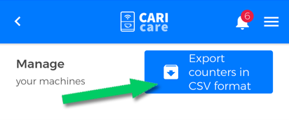</kbd>

## Filter machines by properties

You can use several filters to reach one or more machines rapidly by making a research based on: 

- **Installation**.  You can view **the installed or not installed machines** by ticking the respective box.

<kbd>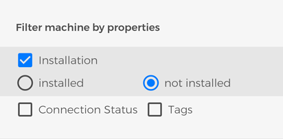</kbd>

- **Connection Status**. You can view **the connected or disconnected machines** by ticking the respective box.

<kbd>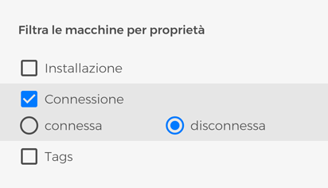</kbd>

- **Tags**. You can filter machines by one or more tags you assigned them.

<kbd>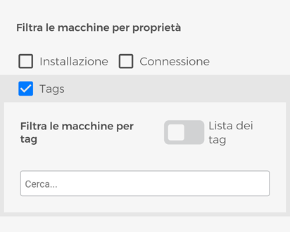</kbd>

You can view all the tags by using the **"tag list"** switch. 

<kbd>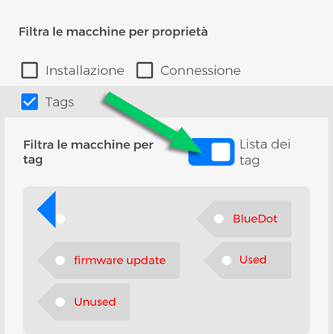</kbd>

You can also filter by one or more tags by typing its name in the **"Search"** field. 

<kbd>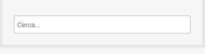</kbd>
 
**Please Note:** for more information on how to create and to assign the taga,  go to [Tags section](https://carimali.github.io/wiki/#/docs-en/tags).

## Azioni sulle macchine

Nella sezione **“LE TUE MACCHINE”** trovi **tutte le macchine da caffè compatibili con CARIcare** che ti sono state assegnate e alcune funzioni necessarie alla gestione delle stesse.

Come in tutto il sistema CARIcare, l’identificativo univoco per ogni singola macchina è il **seriale** e ha corrispondenza con quello riportato sulla targhetta della macchina da caffè, fatta eccezione per il **_CA_** che lo precede: per esempio, nel punto indicato nell'immagine che segue, è mostrato il seriale 254168

<kbd>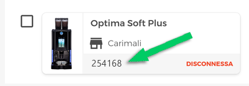</kbd>

che trovi nella targhetta della macchina corrispondente:

<kbd>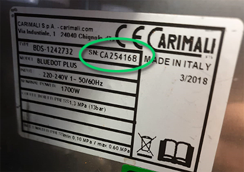</kbd>

Su ciascuna macchina oltre al seriale è riportato il **modello**, una **miniatura**, lo **stato della connessione** con il server CARIcare e, se **assegnata**, il **cliente** che la possiede al momento.
Il checkbox alla sinistra di ciascuna macchina ti permette di selezioniare **una o più macchine contemporanemente, tutte le funzioni di questa area quando eseguite vengono applicate alla selezione**.

<kbd></kbd>

**Nota:** puoi usare l'area filtro per affinare ulteriormente la ricerca sull'insieme di macchine visualizzate.

  
  
## Assegnare le macchine

Dopo aver creato un cliente, puoi usare questa funzione per assegnargli le tue macchine da caffè. Che si tratti di noleggio o vendita, è un modo per organizzarle e gestire al meglio il tuo business. Una volta che hai selezionato una o più macchine, premi **"assegna a"**;

<kbd>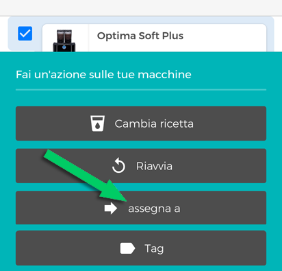</kbd>

scegli un Cliente dal menù a tendina e premi **"Salva"**.
 
<kbd>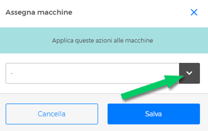</kbd>

 
Ora le macchine selezionate sono **assegnate e visibili** anche nell'Area Macchine, sotto la scheda **Cliente** *mettere link alla pagina cliente sezione macchine*. Se è stato creato un account CARIcare anche per il cliente, quest'ultimo potrà visualizzarle nella sezione **Macchine**.

## Gestire le ricette
 
Selezionando una o più macchine e premendo **"cambia ricetta"**, puoi scegliere un **set di ricette** dall'elenco a tendina e caricarlo sulle macchine selezionate.

<kbd>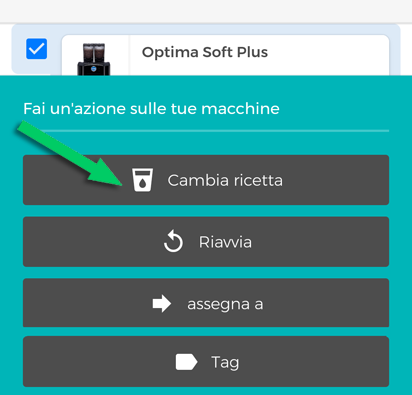</kbd>

Oppure, premi **una ricetta** per modificarla: puoi abilitarla/disabilitarla, cambiare icona e, se previsto dalla configurazione prezzo e tipo di bicchiere; modificare ogni singolo parametro proprio come se ti trovassi di fronte alla macchina da caffè! Per tutte le informazioni relative a come impostare i parametri fai riferimento al manuale d'uso. Premi **Salva modifiche** prima di lasciare quest'area altrimenti tutte le modifiche apportate andranno perse.

**Nota:** le modifiche verranno effettuate su tutte le macchine selezionate.

## Riavviare le macchine 

Dopo aver selezionato una o più macchine, premi **"Riavvia"** per riavviare le macchine selezionate. Conferma l'operazione premendo il tasto **"Procedi"**.

<kbd>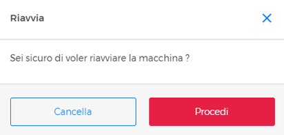</kbd>

## Assegnare un TAG alle macchine

Per assegnare un **tag** alle tue macchine premi **"Tag"**; attiva lo switch **"Lista dei tags"** per visualizzare la lista dei tags disponibili; scrivi il/i nome/i del/i tag/s nell'area di testo **"Cerca"**, quindi premi **"Salva"**.

<kbd>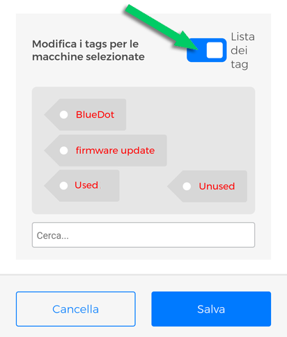</kbd>

