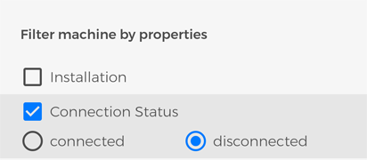
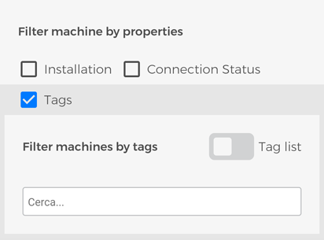
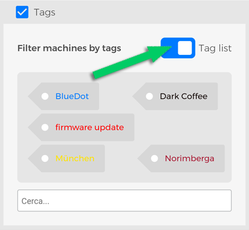
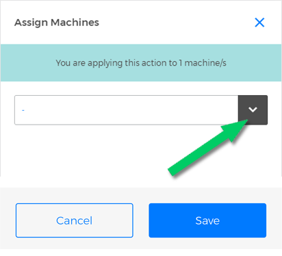
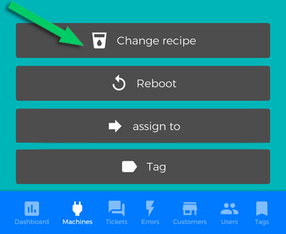
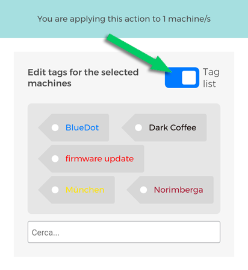

# Your Machines

## Export counters in CSV format

Click **"Export counters in CSV format"** button to create a **CSV** (Comma-Separated Values) document that contains **your machines counters**.

<kbd></kbd>
 
## Filter machines by properties

You can use several filters to reach one or more machines rapidly by making a research based on: 

- **Installation**.  You can view **the installed or not installed machines** by ticking the respective box.

<kbd></kbd>

- **Connection Status**. You can view **the connected or disconnected machines** by ticking the respective box.

<kbd></kbd>

- **Tags**. You can filter machines by one or more tags you assigned them.

<kbd></kbd>

You can view all the tags by using the **"tag list"** switch. 

<kbd></kbd>

You can also filter by one or more tags by typing its name in the **"Search"** field. 

<kbd></kbd>
 
**Please Note:** for more information on how to create and to assign the taga,  go to [Tags section](https://carimali.github.io/wiki/#/docs-en/tags).

## Actions on your machines

On **"Your machines”** section, you can find **all coffee machines compliant with CARIcare** which you have been assigned and some features required for their management.

As for the whole CARIcare system, the unique ID for each machine is the **"serial number"** and it matches the number on the label
of the machine without the **_CA_**; for example, the picture below shows the serial number **254168**:

<kbd></kbd>

you can find it on the respective label machine:

<kbd></kbd>

Each machine pane shows the **serial number**, the **model**, a **machine thumbnail**, the **connection status** (connected/disconnected) to CARIcare server and, if assigned, the the customer who owns it.

The **checkbox** allows you to select one or more machines in the same time; all functions are applied to all selected machines.

<kbd></kbd>

**Please Note:** you can further refine your search by using the filters on displayed machine.

  
  
## Assigning the machines

If you have already created a customer account, you can use this feature to assign him your coffee machines. Whether it's rental or sale, it's a good way to organise them and better manage your business. Once You have selected one or more machines, click **"assign to"**;

<kbd></kbd>

Choose a customer from drop-down menu then click **"Save"**. 
 
<kbd></kbd>

Now the selected machines are assigned and displayed in the Machines section of the customer details. 

## Manage Recipes
 
You can choose a **recipe set** by selecting one or more machines and clicking **change recipe**. The set will loaded in the selected machine.

<kbd></kbd>

Click a **recipe** to modify it: you can enable/disable the recipe, change the icon and, if provided for in machine configuration, the price and the type of glass; you can update every single parameter just as if you were right in front of your coffee machine!
For a detailed explanation of how to configure the machine, please refer to user manual. 
Click **Save** to keep your changes: otherwise, all changes will be lost.

**Please Note:** changes will be applied to the selected machines.

## Reboot machines 

After selecting one or more machine, click **"Reboot"** to reboot the selected machines. Confirm the operation by pressing **"Proceed"**.

<kbd></kbd>

## Assigning a TAG to the machines

In order to assign a **tag** to your machines, click **"Tag"**; use **"Tags list"** switch to display the list of available tags; enter the name of tag in the **"Search"** textarea then click **"Save"**.

<kbd></kbd>

