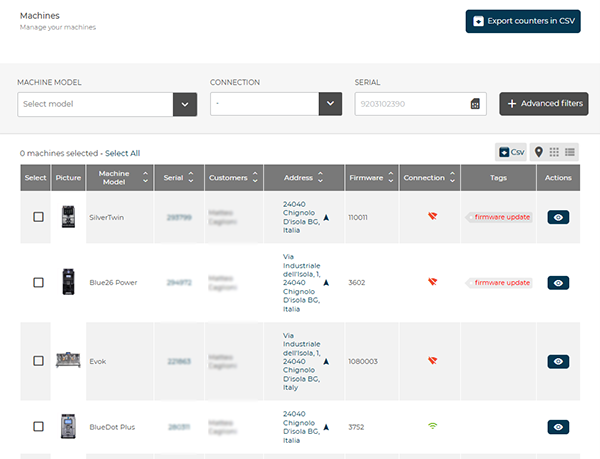
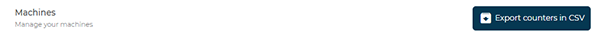
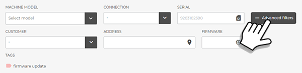
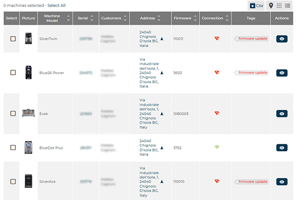
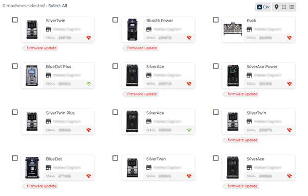
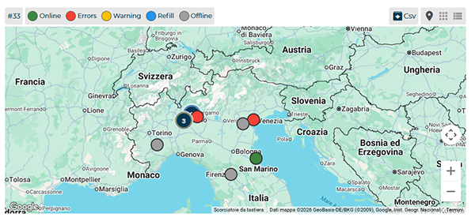
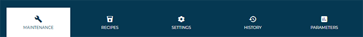
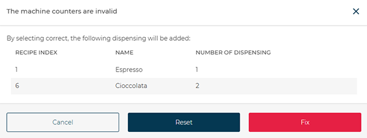
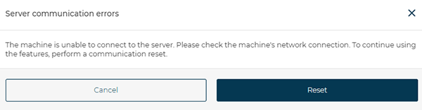
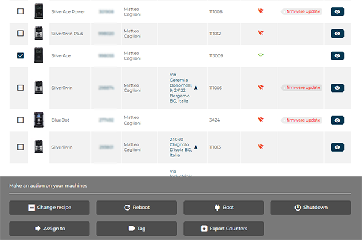

# Machines

The **Machines** section allows the visualization, search, and management of coffee machines connected to the **CARIcare** platform.  
From this area, machines can be filtered based on different parameters, counters can be exported, firmware can be updated, recipes can be managed, and remote commands can be sent.

<kbd></kbd>

---

## Export counters to CSV

The **Export counters to CSV** button generates a CSV (Comma-Separated Values) file containing the updated counter data of the displayed machines.  
The file can be used for analysis, reporting, or data archiving purposes.

<kbd></kbd>

---

## Search filters

The top section of the screen contains a set of **filters** that allow quick identification of one or more machines based on specific criteria.

Available fields:

* **Model** – Filters machines by model.
* **Connection** – Allows selection of *connected* or *disconnected* machines.
* **Serial** – Direct search by unique serial number.

The **Advanced filters** button allows expanding or collapsing the available criteria.

Additional fields:

* **Customer** – Displays machines assigned to a specific customer.
* **Address** – Allows search by location.
* **Firmware** – Filters by installed firmware version.
* **Tags** – Filters based on assigned tags (e.g. **Firmware update**).

<kbd></kbd>

---

## Machine list

The lower section of the page displays the **machine list** with the main operational data, available in three different views.

### List view

Displays machines in a tabular format, one per row.

Each entry includes:

* **Image**
* **Model**
* **Serial**
* **Customer**
* **Installation address**
* **Firmware version**
* **Connection status**
* **Tags**
* **Actions**

<kbd></kbd>

---

### Grid view

Displays machines in a card layout with a compact format.  
This view improves visual recognition through the model image.

<kbd></kbd>

---

### Map view

Displays the geographical distribution of machines on an interactive map.

Each machine is represented by a marker differentiated by operational status:

* 🟢 **Online** – Machine connected and operational  
* 🔴 **Error** – Presence of errors or anomalies  
* 🟡 **Warning** – Attention status  
* 🔵 **Refill** – Refill required  
* ⚪ **Offline** – Machine not connected  

The map supports:

* Zoom and geographic navigation
* Global and local visualization
* Marker selection for quick access to information

<kbd></kbd>

---

The view modes can be selected using the **List**, **Grid**, or **Map** buttons located in the top-right corner.  
On **smartphone** devices, the default view is **list**, optimized for smaller screens.

Each row or card represents a single machine.  
The **Sel.** column allows multi-selection for batch operations.

The **CSV** button allows exporting the displayed list.

---

## Status indicators

Each machine may display visual indicators describing its operational status.

  
Allows access to the [machine overview page](docs-it/machine.md).

From this section, the following information is available:

### MAINTENANCE

<kbd></kbd>

* General machine status
* Recent dispensing data
* Operating temperatures
* Counters
* Washing cycles
* Calibration parameters
* Geographic location
* Scheduled maintenance
* Coffee group cycles
* Last 24h dispensing
* Product consumption
* Connection status

---

### RECIPES

<kbd></kbd>

* Import recipe set
* List or grid view

---

### SETTINGS

<kbd></kbd>

* Machine configuration
* Firmware
* Language
* Payment system
* Timezone
* Brewer
* Consumption
* Maintenance scheduling
* Counter management

---

### HISTORY

<kbd></kbd>

* Error history
* Washing history
* Firmware update history

---

### PARAMETERS

(available for SilverAce models with latest firmware)

<kbd></kbd>

* Clock settings
* Cleaning and maintenance
* Display options
* Machine parameters

---

  
Indicates the presence of anomalies.

Main types:

* **Invalid counters** – Dispensing performed while the machine has been offline for more than three days.

  <kbd></kbd>

  Available actions:
  * **Reset**
  * **Correct**

* **Server communication anomaly** – Unstable connection with the server.

  <kbd></kbd>

  Available action:
  * **Reset**

---

## Machine actions

By selecting one or more machines, the action panel appears at the bottom of the screen.

<kbd></kbd>

Available functions:

* **Change recipe** – Updates recipes (max 10 machines, same model).
* **Update firmware** – Available when *Firmware update* tag is present.
* **Restart** – Remote reboot.
* **Start** – Power on machine.
* **Shutdown** – Remote shutdown.
* **Assign to** – Assign to customer.
* **Tag** – Manage tags.
* **Export counters** – Export CSV file.

All operations apply only to the selected machines.