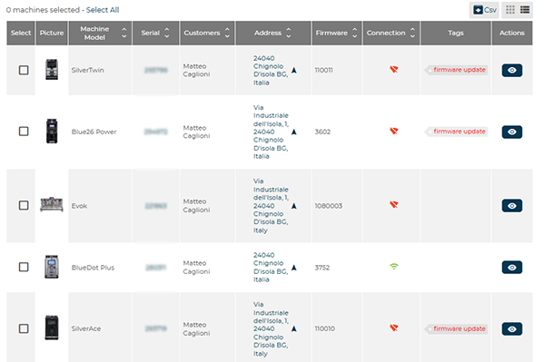
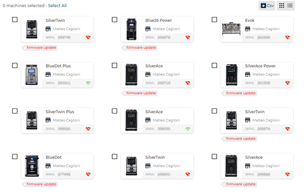

# Machines

The **Machines** section enables viewing, searching, and managing the coffee machines connected to the **CARIcare** platform.
From this area it is possible to filter machines by various parameters, export counters, update firmware, manage recipes, or send remote commands.

<kbd></kbd>

---

## Export counters to CSV

The **Export counters to CSV** button generates a CSV (Comma-Separated Values) file containing up-to-date counter data for the listed machines.
The resulting file can be used for analysis, statistics, or archiving of dispensing data.

<kbd></kbd>

## Search filters

The upper part of the screen contains a set of **filters** that allow quick identification of one or more machines based on specific criteria.

Available fields:

* **Model** – Filters machines by model.
* **Connection** – Allows selection of *connected* or *disconnected* machines only.
* **Serial** – Direct search by unique serial number.

The **Advanced filters** button expands or collapses the search criteria display.

* **Customer** – Shows machines assigned to a specific customer.
* **Address** – Enables search by the machine’s location or site.
* **Firmware** – Filters by the installed firmware version.
* **Tags** – Allows selection of machines by assigned tags
  (e.g., selecting **Firmware update** filters machines for which a software update is available).

<kbd></kbd>

---

## Machine list

The lower part of the page shows the **machine list** with key operational data, available in two display modes:

* **List view**
  Displays machines in a tabular format, one per row.
  Each entry includes:

  * **Image**
  * **Model**
  * **Serial**
  * **Customer**
  * **Installation address**
  * **Installed firmware** version
  * **Connection status**
  * **Tags**
  * **Actions**

  <kbd></kbd>

* **Grid view**
  Displays machines as cards, with the same key information in a more compact layout.
  This mode enables faster visual recognition thanks to the model image.

  <kbd></kbd>

The two modes can be toggled using the **List** or **Grid** buttons at the top right.
On **smartphone** devices, the default display is **list view**, optimized for screen size.

Each row or card represents a single machine.
The **Sel.** column or the checkbox next to each machine allows **multi-selection** to apply bulk actions.
The **CSV** button at the top right allows **exporting the displayed list** in **.csv** format.

---

### Status indicators

Each machine may display **icons or visual indicators** that provide information on operational status:

 Allows [access to the overview page](docs-it/machine.md) of the selected machine.

From this page, it is possible to view in real time:

* **MAINTENANCE**

  <kbd></kbd>

  * **Overall machine status**
  * **Recent dispensing**
  * **Operating temperatures (coffee and steam)**
  * **Global and partial counters**
  * **Washing cycles**
  * **Calibration parameters**
  * **Geographical location**
  * **Quarterly / annual maintenance**
  * **Coffee group cycle count**
  * **Dispensing in the last 24 hours**
  * **Product consumption** where available
  * **Connection status**

* **RECIPES**

  <kbd></kbd>

  * **Import a recipe set**
  * **Recipes** list view / grid view

* **SETTINGS**

  <kbd></kbd>

  * **Machine configuration**
  * **Firmware**
  * **Language**
  * **Payment system**
  * **Timezone**
  * **Brewer**
  * **Product consumption**
  * **Scheduled date for extraordinary maintenance**
  * **Counter reset and updates**

* **HISTORY**

  <kbd></kbd>

  * **Errors** history
  * **Washing** history
  * **Firmware updates** history

* **PARAMETERS** (SilverAce models only with latest firmware)

  <kbd></kbd>

  * **Clock management**
  * **Cleaning and maintenance**
  * **Display options**
  * **Machine parameters**

 Indicates the presence of one or more **anomalies associated with the machine**.

* **invalid counters**: number of dispenses executed while the machine has been disconnected for more than three days.

  <kbd></kbd>

  Select *Reset* to clear the dispensing count, or select *Fix* to add dispenses performed in offline mode to the sales history.

* **Communication anomaly with server**: the connection to the server is unstable.

  <kbd></kbd>

  Select *Reset* to clear the anomaly.

---

## Actions on machines

By selecting one or more serial numbers, the **Perform an action on your machines** section appears at the bottom of the screen, grouping all applicable operational functions.

When multiple machines are selected simultaneously, some functions are unavailable and appear disabled: *Restart*, *Start*, *Shutdown*.

<kbd></kbd>

* **Change recipe** – Allows **updating the recipe set** for the selected machines.
  The operation can be performed on **multiple machines simultaneously** (max. 10), provided they belong to **the same model** and have **the same configuration**.

* **Update firmware** – Starts the firmware update process for the selected machines only when the *Firmware update* tag is present.

* **Restart** – Performs a remote restart of the machine.

* **Start** – Reactivates a machine in a stopped state.

* **Shutdown** – Performs a remote shutdown.

* **Assign to** – Associates one or more machines with an existing customer.

* **Tag** – Assigns or modifies associated tags.

* **Export counters** – Generates a **CSV** file containing the updated counter data for the selected machines.

All operations are applied exclusively to the machines selected in the list.
