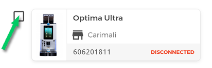
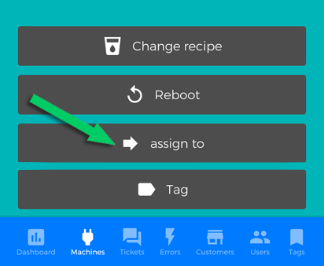
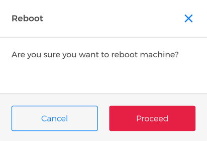

# Your Machines

## Export counters in CSV format

Click **"Export counters in CSV format"** button to create a **CSV** (Comma-Separated Values) document that contains **your machines counters**.

<kbd></kbd>
 
## Filter machines by properties

You can use several filters to reach one or more machines rapidly by making a research based on: 

- **Installation**.  You can view **the installed or not installed machines** by ticking the respective box.

<kbd></kbd>

- **Connection Status**. You can view **the connected or disconnected machines** by ticking the respective box.

<kbd></kbd>

- **Tags**. You can filter machines by one or more tags you assigned them.

<kbd></kbd>

You can view all the tags by using the **"tag list"** switch. 

<kbd></kbd>

You can also filter by one or more tags by typing its name in the **"Search"** field. 

<kbd></kbd>
 
**Please Note:** for more information on how to create and to assign the taga,  go to [Tags section](https://carimali.github.io/wiki/#/docs-en/tags).

## Actions on your machines

On **"Your machines”** section, you can find **all coffee machines compliant with CARIcare** which you have been assigned and some features required for their management.

As for the whole CARIcare system, the unique ID for each machine is the **"serial number"** and it matches the number on the label
of the machine without the **_CA_**; for example, the picture below shows the serial number **254168**:

<kbd></kbd>

you can find it on the respective label machine:

<kbd></kbd>

Each machine pane shows the **serial number**, the **model**, a **machine thumbnail**, the **connection status** (connected/disconnected) to CARIcare server and, if assigned, the the customer who owns it.

The **checkbox** allows you to select one or more machines in the same time; all functions are applied to all selected machines.

<kbd></kbd>

**Please Note:** you can further refine your search by using the filters on displayed machine.

  
  
## Assigning the machines

If you have already created a customer account, you can use this feature to assign him your coffee machines. Whether it's rental or sale, it's a good way to organise them and better manage your business. Once You have selected one or more machines, click **"assign to"**;

<kbd></kbd>

Choose a customer from drop-down menu then click **"Save"**. 
 
<kbd></kbd>

Now the selected machines are assigned and displayed in the Machines section of the customer details. 

## Gestire le ricette
 
Selezionando una o più macchine e premendo **"cambia ricetta"**, puoi scegliere un **set di ricette** dall'elenco a tendina e caricarlo sulle macchine selezionate.

<kbd></kbd>

Oppure, premi **una ricetta** per modificarla: puoi abilitarla/disabilitarla, cambiare icona e, se previsto dalla configurazione prezzo e tipo di bicchiere; modificare ogni singolo parametro proprio come se ti trovassi di fronte alla macchina da caffè! Per tutte le informazioni relative a come impostare i parametri fai riferimento al manuale d'uso. Premi **Salva modifiche** prima di lasciare quest'area altrimenti tutte le modifiche apportate andranno perse.

**Nota:** le modifiche verranno effettuate su tutte le macchine selezionate.

## Riavviare le macchine 

Dopo aver selezionato una o più macchine, premi **"Riavvia"** per riavviare le macchine selezionate. Conferma l'operazione premendo il tasto **"Procedi"**.

<kbd></kbd>

## Assegnare un TAG alle macchine

Per assegnare un **tag** alle tue macchine premi **"Tag"**; attiva lo switch **"Lista dei tags"** per visualizzare la lista dei tags disponibili; scrivi il/i nome/i del/i tag/s nell'area di testo **"Cerca"**, quindi premi **"Salva"**.

<kbd></kbd>

