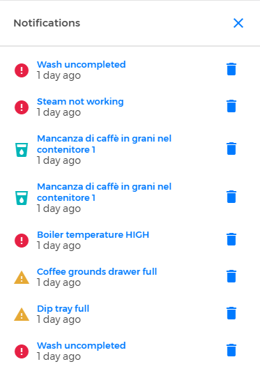

# Notifications

When you access the CARIcare platform dashboard, you can find the number of new **notifications** in the top-right corner. 

<kbd></kbd>

Tap on the bell icon to access **the notifications page**; this page shows you the new notifications and the old ones. 

<kbd></kbd>

Each notification provides the type of error (eg. "critical", "refill" or "warning") or the availability of a new machine firmware. In case of disconnect, the notification shows the serial machine number. 

By clicking a single notification you access the [Errors](https://carimali.github.io/wiki/#/docs-eng/errori) section or the machine area whose firmware must be updated.

Each notification can be deleted by using the bin button: you can find the deleted notification in the **old notifications** list.  

**Please Note:** each notification coming via email; each error generates an email message that will be received by technical support. 

