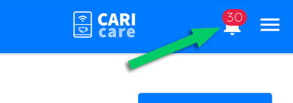
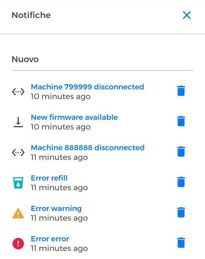

# Notifiche

Quando accedi alla dashboard della piattaforma CARIcare, in alto a destra è evidenziato il numero di **notifiche** presenti. 

<kbd></kbd>

Clicca sull'icona a forma di campanello per **accedere alla pagina delle notifiche**. Questa pagina mostra in prima le **nuove** notifiche poi le **vecchie**. 

<kbd></kbd>

Ogni notifica riporta il **tipo di errore** ("critico", "refill" o "warning") oltre ad altre informazioni come la disponibilità di un nuovo firmware per la macchina. Nel caso di una disconnessione, la notifica indica anche il numero della macchina.

Cliccando su una singola notifica si accede direttamente alla sezione "**"Errori"** o all'area dedicata alla macchina di cui deve essere aggiornato il firmware.

Una notifica può essere cancellata utilizzando il bottone con l'icona del cestino alla sua destra: noterai che la notifica cancellata sarà presente nella lista delle notifiche **vecchie**.

**Nota:** tutte le notifiche arrivano via email. Ogni errore genera un messaggio email ricevuto dal supporto tecnico di competenza.

