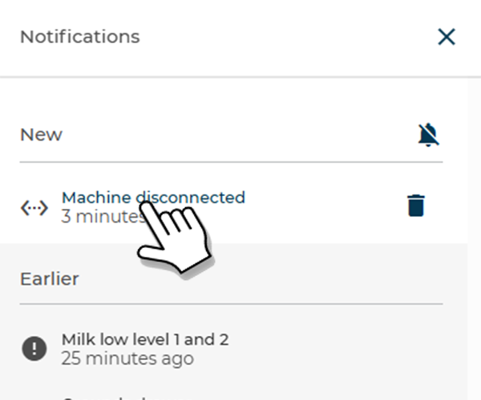
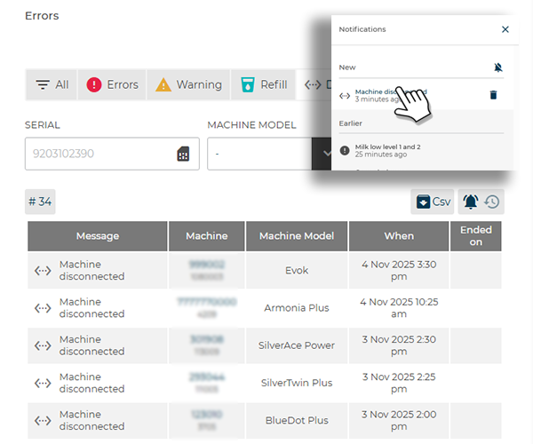
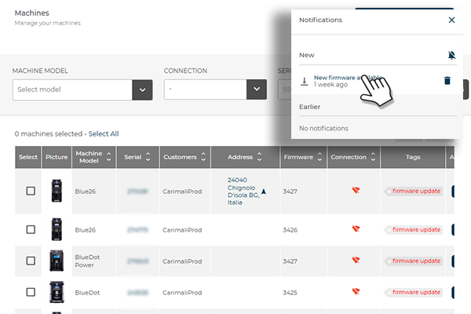

# Notifications

At the top right of the **Dashboard**, the bell icon displays the **counter** for unread notifications.

<kbd></kbd>

Clicking the bell opens the **Notifications** panel, divided into **New** (unread) and **Old** (read/archived).

<kbd></kbd>

## What It Displays

* **Notification type** – Identified by an icon representing the nature of the event — *Error*, *Warning*, *Refill*, *Disconnected Machine* — or by a specific tag such as *Firmware Update*.
  Next to the icon, the **cause of the error** is also displayed (for example, *Door open* or *Low milk level*).

* **Timestamp details** – Below each notification, the **time of occurrence** is indicated, expressed in minutes, hours, or days elapsed since the event.

## Quick Actions

* **Open notification** – Click the text to navigate directly to the relevant section:

<kbd></kbd>

* **ERRORS PAGE** → displays the list filtered by error type.

<kbd></kbd>

* **MACHINES PAGE** → displays the list of machines with the **firmware update** tag enabled.

<kbd></kbd>

* **Trash icon** – Moves notifications from the **New** list to the **Old** list.
  The notification remains visible for 7 days before being automatically removed.

* **Muted bell icon** – Moves all notifications currently in the **New** section to **Old** automatically.
