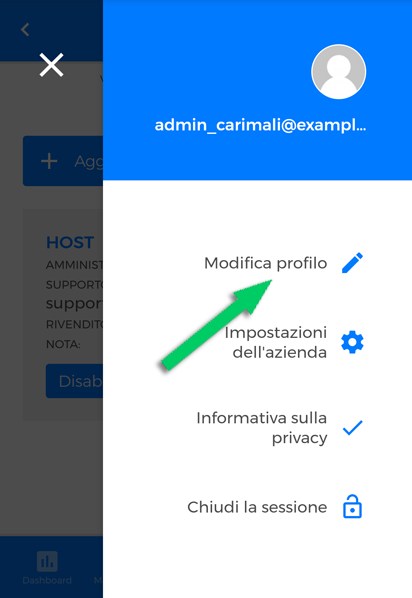

# Profile

## Profile Settings

In order to access Your profile click the *hamburger button* on the top-right. 

<kbd></kbd>

On Your personal tab, click **"Edit Profile"**.

<kbd></kbd>

On the "Edit profile" page, you can update your personal data by filling in the fields **"first name"**, **"last name"**, **"email"** and choosing the platform language.

<kbd></kbd>

In addiction to this, you can choose the notifications you want to receive depending on the type of alarm, by checking the respective box.

<kbd></kbd>

Please remember to click **"Save"** to keep any changes.

## Edit Company Settings

On Your personal tab, you can assign a "user support" by clicking on "**Company Settings**"

<kbd></kbd>

<kbd></kbd>

Please remember to click **"Save"** to keep any changes.

