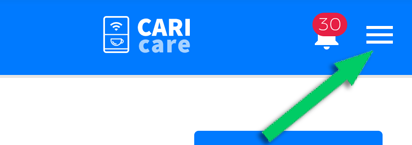

# Profile

<kbd></kbd>

Within the personal profile panel, the following functions are available:

## **Edit Profile**

Allows you to update personal information and change your login password.

<kbd></kbd>

This section lets you:

* Update:

  * **First Name**
  * **Last Name**
  * **Email**
  * **Language** – selectable from the drop-down menu to set the interface language.

<kbd></kbd>

* Change the current password

<kbd></kbd>

The new password must meet the following requirements:

* Minimum **8 characters**
* At least **one uppercase letter**
* At least **one lowercase letter**
* At least **one number**
* At least **one special character**

Enter the new password in both fields (**Password** and **Confirm Password**) and press **Save** to confirm the changes.
The **Edit Profile** button returns you to the main configuration screen.

### Configure Notifications

This section allows you to configure notifications related to system events.
For each notification type, the available delivery channels are indicated: **Email**, **Notifications**, and **Popup**.

| Notification Type   | Description                                                           | Email | Notifications | Popup |
| ------------------- | --------------------------------------------------------------------- | :---: | :-----------: | :---: |
| **Error**           | Indicates the presence of an error (e.g., door open, system anomaly). |   📧  |       🔔      |  N/A  |
| **Warning**         | Non-critical alerts or system warnings.                               |   📧  |       🔔      |  N/A  |
| **Refill**          | Indicates the need for refills or consumables.                        |   📧  |       🔔      |  N/A  |
| **Disconnection**   | Alerts when a machine has lost connection.                            |   📧  |       🔔      |  N/A  |
| **Firmware Update** | Notifies about available firmware updates.                            |   📧  |       🔔      |  N/A  |
| **Machine Actions** | Reports automatic commands or system actions.                         |  N/A  |      N/A      |   💬  |

> **N/A** indicates that the notification type is not available through that channel.

Example of a popup notification:

<kbd></kbd>

At the bottom of the page, the [**API Key**](/docs-en/api) associated with the account is displayed, which can be used for integration with external systems.
For security reasons, it must **not** be shared with other users.

## **Privacy Policy**

Opens the section dedicated to reviewing and managing the privacy policy.

## **Logout**

Ends the current session and logs the user out of their account.
