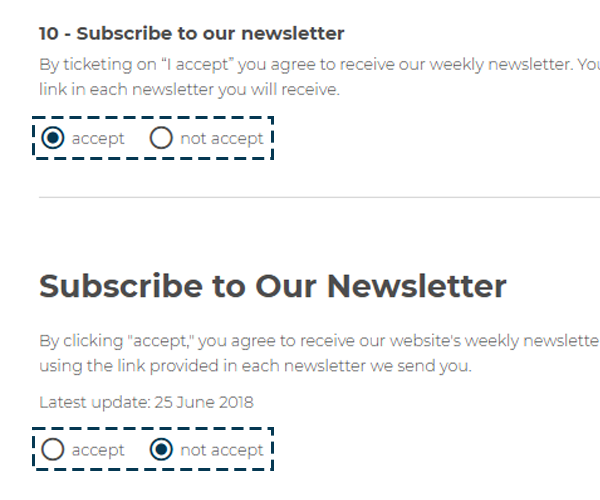
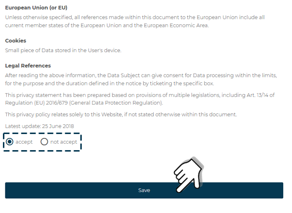

# How to Access CARIcare

To access the **CARIcare** platform, open the web browser on your device and type the following address in the URL bar:

[https://caricare.carimali.com](https://caricare.carimali.com)

Then press **Enter** to confirm and reach the login page.

---

## Access and Authentication

After opening the website, the **Login** page will appear.
Enter the credentials received via email in the appropriate fields:

1. **Username**
2. **Password**

Once the data has been entered, press **Log in** to access the platform.

Credentials can be saved by selecting the **Remember me** option.
If the password has been lost, the recovery function is available [by clicking here](https://carimali.github.io/wiki/#/docs-it/recover-password).

<kbd></kbd>

---

## Usage Policy and Data Privacy

Upon **first login**, it is necessary to accept the **CARIcare Privacy Policy** and **Cookie Policy**.
This step is mandatory to ensure data confidentiality and compliance with current regulations.
Without acceptance of the policies, **no features of the platform can be used**.

During this step, the user may also choose to subscribe to the **Carimali newsletter** to receive updates and news about **CARIcare** products and services.

---

### Policy Acceptance

1. Select **Accept** to agree to the *CARIcare Privacy Policy*.

<kbd></kbd>

2. Select **Accept** to agree to the *CARIcare Cookie Policy*.

<kbd></kbd>

3. Press **Save** to store your preferences.

---

### Preference Management

Settings related to the **Privacy Policy** and **Cookie Policy** can be modified at any time from the user profile.
It is important to note that **rejecting even one of the two policies** will result in the account being **unable to use any feature of the CARIcare platform**.
