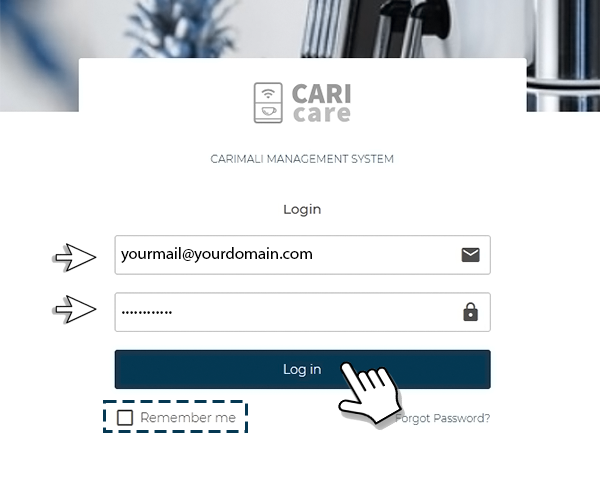
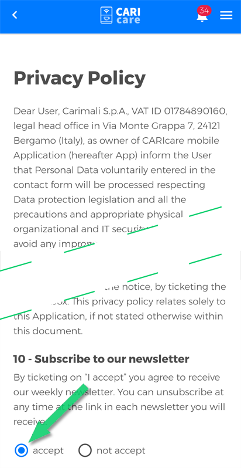

# How to access

To reach CARIcare, open the browser of your device then type caricare.carimali.com or caricare.tech.

## Authentication

On the **Login** page, insert **"user name"**  (1) and **"password"** (2), then press **"Log in"** button (3). You can keep the password by checking the **"Remember me"** box (4). If you forgot your password, [click here](https://carimali.github.io/wiki/#/docs-it/recover-password).

<kbd></kbd>

## Terms of use and Privacy Policies

At the first login, accepting Privacy and Cookie Policies is necessary to ensure the confidentiality of information according to the rules. Failure to do so is going to make it impossibile to use the application features.
You can subscribe to the Newsletter to keep yourself updated about the Carimali and CARIcare news. 

Press **"accept"** to accepting the CARICare *Privacy Policy* 

<kbd></kbd>

Press **"accept"** to accepting the CARICare *Cookie Policy*  then press **Save**  to keep your prefencies.

<kbd></kbd>

**Please Note:** You can change your Privacy and Cookie Policies preferences at any time from your account. However, rejecting one of them will make it impossibile to use the application features.

