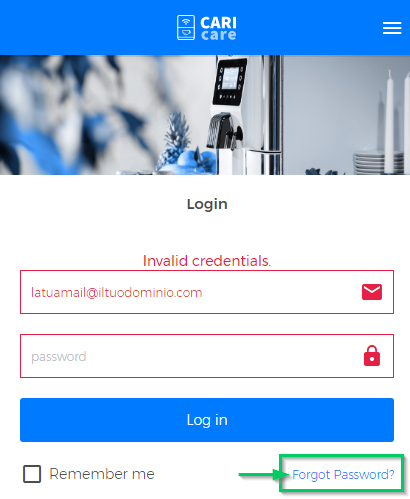
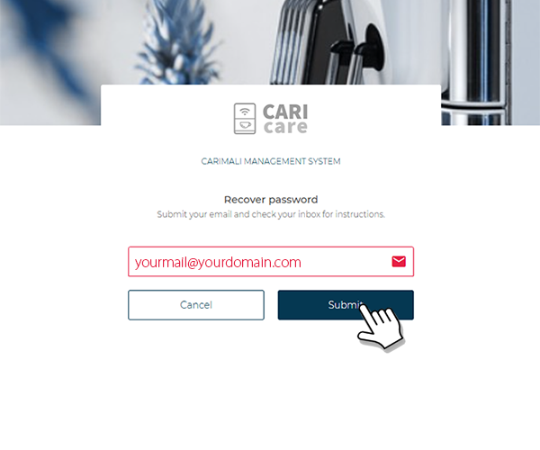

# Recover password

If you forgot your password or you want to change it, follow these steps:	

- type the following address on your device browser: https://caricare.carimali.com/login or [click here](https://caricare.carimali.com/login) in order to access the CARIcare **Login** page;

- press **Forgot Password** link as shown below:

<kbd></kbd>

- on the new screen **"Recover password"**, insert your account **email**(1) and then press **"Submit"**(2) as shown below:

<kbd></kbd>

Press **"Cancel"** at any time to abort the operation.

