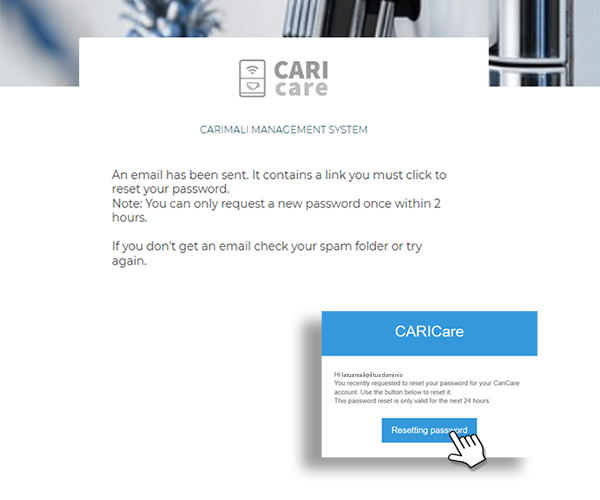
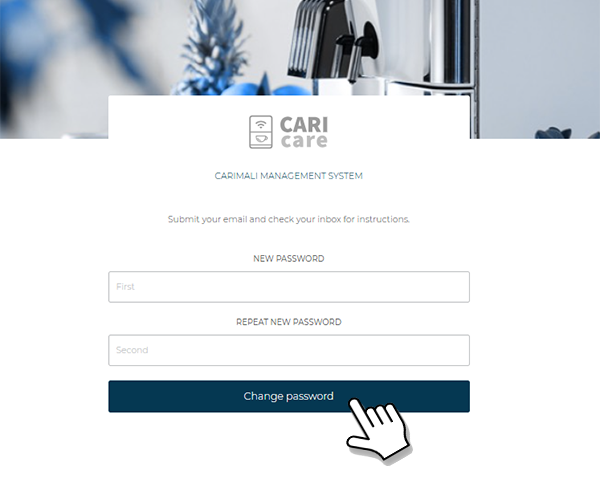

# Recover Password

If the access password has been forgotten, it can be reset by following the procedure described below.

1. Open the web browser on the device and type the address [https://caricare.carimali.com/login](https://caricare.carimali.com/login), then press **Enter** to access the authentication page.

2. On the **Login** screen, select the **Forgot Password** option, as shown in the image below:

   <kbd></kbd>

3. On the **Forgot Password** page, enter the **email address** associated with the **CARIcare** account, then press **Submit** to send the recovery request.
   The operation can be cancelled by pressing **Cancel**.

   <kbd></kbd>

4. Access the mailbox corresponding to the entered email address.
   An email from **`caricare@carimali.com`** will be received, containing the link for password reset.
   Select **Resetting password** to continue.

   <kbd></kbd>

5. On the next screen, enter the **new password**, repeat it for confirmation, and press **Change Password** to complete the operation.
   Once finished, log in again using the new credentials.

   <kbd></kbd>