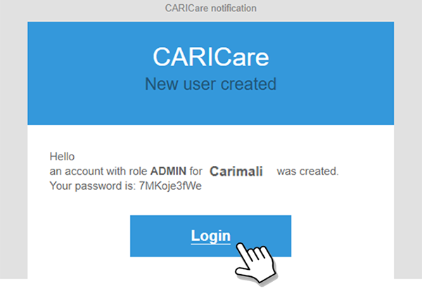

# Access Requirements

To access **CARIcare**, the following are required:

* **login credentials**
* a **device connected to the Internet**

For any questions or further information, contact **[service@veagroup.com](mailto:service@veagroup.com)**.

---

## Login Credentials

Activation must be requested through the **assigned contact person**.

The credentials will be sent via email from **[caricare@carimali.com](mailto:caricare@carimali.com)**.

Direct **Carimali** customers must contact their **sales representative** or **[service@veagroup.com](mailto:service@veagroup.com)**.

---

### Email Content

The email you receive will contain:

* the *role*
* the *username*
* the *password*

<kbd></kbd>

---

### If You Do Not Receive the Email

If activation has been requested, credentials have been confirmed as sent, and the email is not found in the inbox, check the following folders:
**Spam**, **Junk Mail**, **Trash**, **Deleted Items**, or **Archive**.

It is recommended to add **[caricare@carimali.com](mailto:caricare@carimali.com)** to the list of **trusted senders** to ensure proper receipt of all messages from the **CARIcare** system.

If the email is still not found, contact the **assigned reference person** to request a **new delivery**.

---

## Connection and Device

Since **CARIcare** is an online platform, an Internet connection is required for its use.
A broadband connection is not mandatory, but a more stable connection ensures a better user experience.

**CARIcare** can be accessed from multiple devices:

* personal computer
* tablet
* smartphone

The application is responsive and optimized for mobile devices; however, a larger screen provides a more comfortable and efficient user experience.
