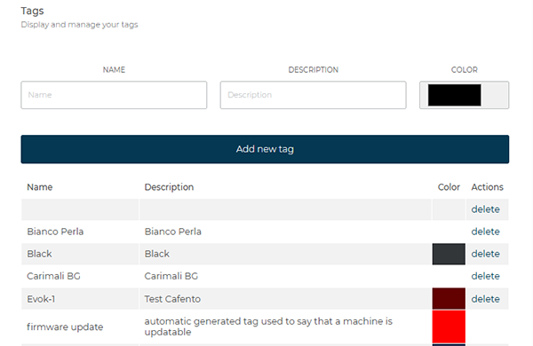
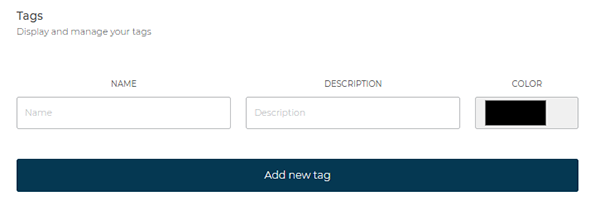

# Tag Management

The **Tags** section allows you to create, view, and manage custom labels used to group and identify one or more machines.
Each tag can include a **name**, a **description**, and a **color** for quick identification.

<kbd></kbd>

## Creating a New Tag

To create a new tag, fill in the following fields:

* **Name** – tag identifier.
* **Description** – explanatory text describing the tag’s purpose or associated machine group.
* **Color** – select the reference color for easy visual recognition.

Click **Add New Tag** to complete the operation.

<kbd></kbd>

## Existing Tag List

The lower part of the page displays the list of created tags, with the option to edit or delete them.
The table provides the main information for each tag.

| Name       | Description                     | Color                                                    | Actions |
| ---------- | ------------------------------- | -------------------------------------------------------- | ------- |
| Test Tag 1 | Machine group – Northern region |  | Delete  |
| Test Tag 2 | Configuration test supervision  |  | Delete  |
| Test Tag 3 | Technical lab monitoring        |  | Delete  |

> Tags automatically generated by the system (*firmware update*) **cannot be manually edited or deleted**.

The tag list is sorted alphabetically and can be updated at any time.

> **Note:** For more information on using tags with machines, refer to the section [**Assigning a Tag to Machines**](/docs-en/machines?id=actions-on-machines).
