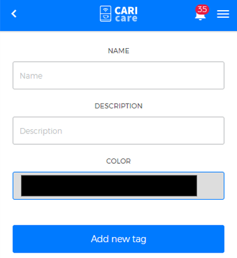

# Manage Tags

**Tags** allows you to create custom tags to identify a specific product; tags are useful for searches and custom views. In addiction to this, you can view **the list of all tags previously created**.

## Create new tag

In order **to create a new tag**, fill in the fields **name**, **description** and choose a reference **colour** for your tag, then click **"Add new tag"** to complete the data entry. 

<kbd></kbd>

The **list of tags** shows the stored tags, in alphabetical order.

**Please Note:** to learn more about tags in relation to the machines, read **"Assegn a tag to the machines"** in chapter  [**"Machines"**](https://carimali.github.io/wiki/#/docs-en/machines) 

