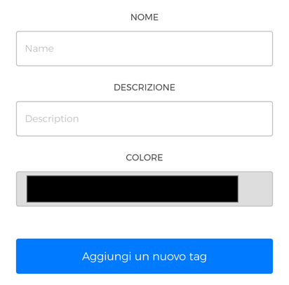

# Gestisci i Tags

La sezione **Tags** ti permette di **creare un'etichetta personalizzata** di riconoscimento di una o più macchine, utile a richiamare velocemente un gruppo di unità. Oltre a questo, nella sezione puoi visualizzare **la lista di tutti i tags precedentemente creati**.

## Crea un nuovo Tag

Per **creare un nuovo tag** definisci i campi **nome**, **descrizione** e scegli il **colore** di riferimento per il tuo tag, quindi premi su **"Aggiungi nuovo tag"** per finalizzare l'inserimento. 

<kbd></kbd>

I tag memorizzati appariranno nella lista dei tags, in ordine alfabetico. 

**Nota:** per approfondire l'argomento dei tags in relazione alle macchine, leggi **"Assegnare un tag alle macchine"** nel capitolo  [**"Macchine"**](https://carimali.github.io/wiki/#/docs-it/machines) 

