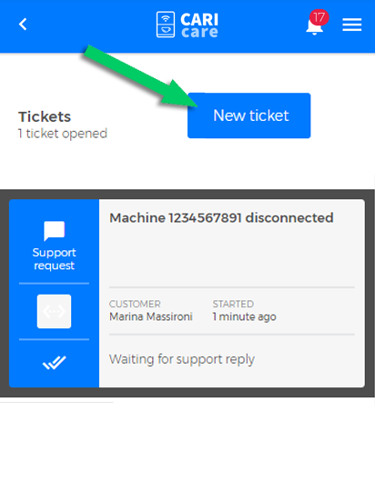
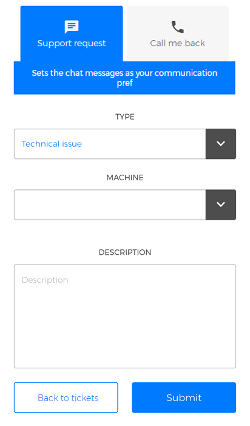
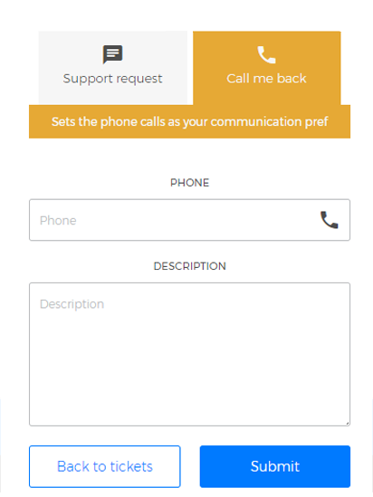

# Technical Support

**"Tickets"** section allows you **to create a new ticket** for the technical support request or to keep track of previously submitted tickets.

## Create a ticket

In order **to create a new ticket**, click **"New ticket"**.

<kbd></kbd>

At this point, You can request support in two ways:

- **"Support request"**. In this mode, you can **set the chat messages as your communication preferred**. Choose the type of problem encountered from **"TYPE"** drop-down list; set the coffee machine model from **"Machine"** drop-down list; fill in the **"Description"** field then click **"Submit"** to send a contact request.

<kbd></kbd>

- **"Call me back"**. In this mode, you can **set the phone calls as your communication preferred**. Enter a **phone number** and describe the issue by filling in **"Description"** field. Click "**Submit**" to send the ticket. 

<kbd></kbd>

