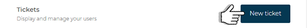
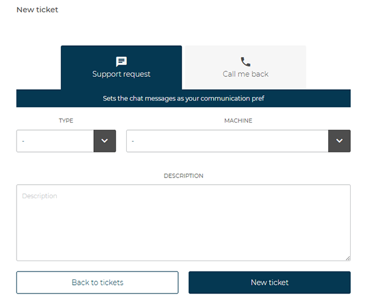
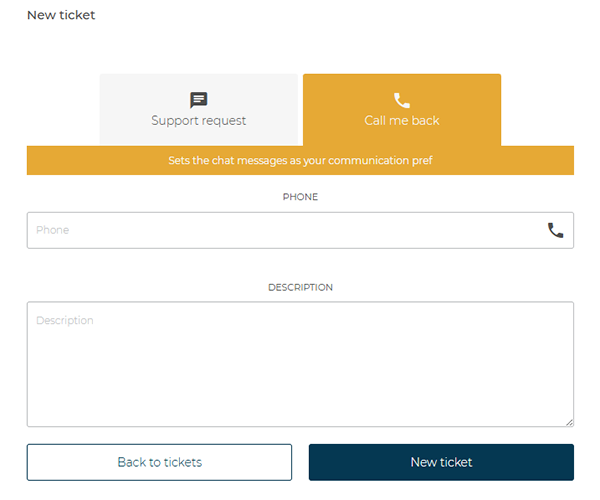
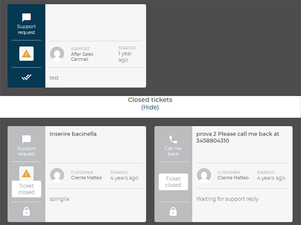
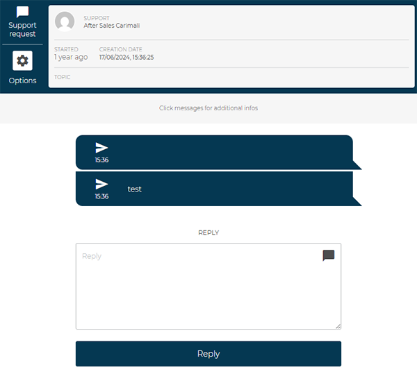
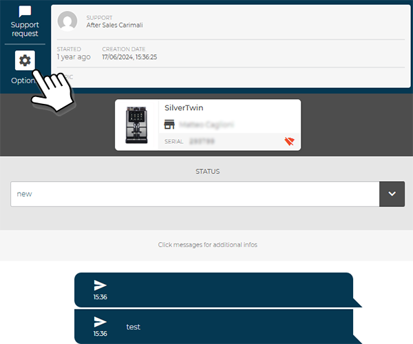

# Contact Technical Support

The **Tickets** section allows users to **manage technical support requests** and **monitor the status of ongoing or completed reports**.
From this page, it is possible to:

* create a new support ticket;
* view the history of submitted requests;
* access open tickets to review the messages exchanged with the technical team.

<kbd></kbd>

## Creating a New Ticket

<kbd></kbd>

To open a new report, select **New Ticket** in the upper-right corner.
The ticket creation page will open, offering two contact modes:

### **Support Request**

<kbd></kbd>

This mode uses **CARIcare** as the communication channel.

* **Type** – select the problem category from the drop-down menu.
* **Machine** – choose the machine related to the request (a drop-down list of all registered machines will appear).
* **Description** – clearly describe the malfunction or required intervention.

Select **New Ticket** to submit the report or **Back to Tickets** to cancel.

### **Call Me (Phone Contact)**

<kbd></kbd>

This mode allows users to **request a direct phone call** from the support technician.
Enter a **valid phone number** and a **brief problem description** in the designated field.
Confirm by selecting **New Ticket** to send the request.

## Ticket Management

All tickets are listed on the main page, divided into:

* **Open tickets**, displayed at the top;
* **Closed tickets**, accessible by selecting *Closed Tickets (Show/Hide)*.

Each ticket card displays:

* the type of request (*Support Request* or *Call Me*),
* the user involved,
* the opening date,
* the ticket status.

<kbd></kbd>

## Viewing and Replying

By clicking on an open ticket, the user can access the detailed conversation view.

<kbd></kbd>

From this screen, it is possible to:

* view **technical details** of the ticket (assigned technician, creation date, associated machine, serial number);
* follow the **message history** exchanged with support;
* **send a reply** using the *Reply* field.

In the ticket details, by selecting the **Options** icon, it is possible to access a dedicated section showing:

* the **details of the machine associated** with the request (machine model, serial number, linked user);
* the **current ticket status**, allowing verification of progress (e.g., *new*, *in progress*, *closed*).

<kbd></kbd>

This feature provides a complete overview of the case under management without leaving the conversation.

> All communications are recorded within the ticket until **closure by the support technician**.
