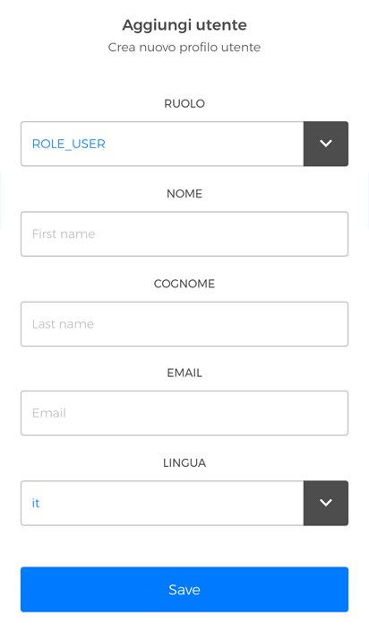
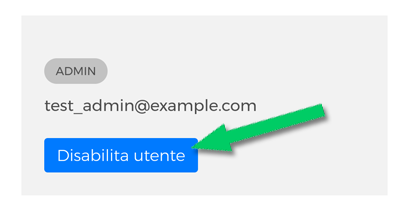

# Menage users

**"Users"** section allows you to **add or to disable** users.

## Add new user

In order **to add a new user profile**, click **"Add new"**.

<kbd></kbd>

On the **"Add user"** choose the **role** (Eg. "user", "admin", "support" or "dealer"); enter "name", "surname", "email" and "language", then click **"save"** to keep your prefencies. 

<kbd></kbd>

## Modify User

If you want to **modify a user's data**, click on his pane and update data. Don't forget to click "Save" to keep your prefencies.

## Disable User

In order **to disable an user**, click the corresponding **"Disable user"** button next to the user to disable then you will be asked to confirm the deactivation. 

<kbd></kbd>
