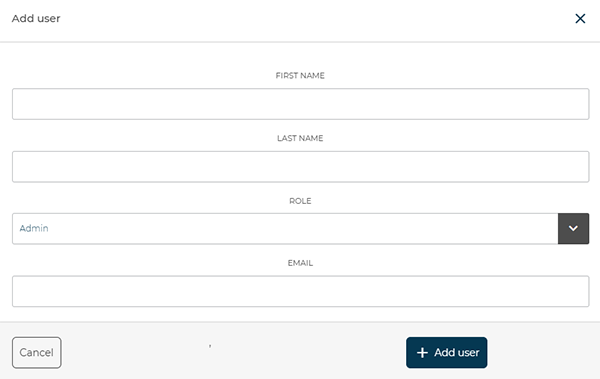
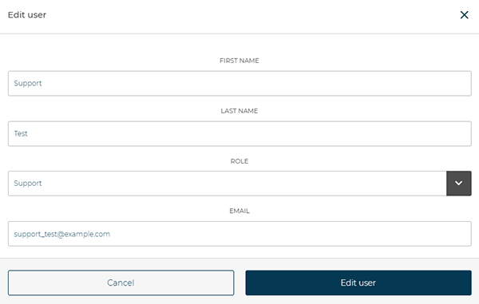

# Users

The **Users** section allows you to **view**, **add**, or **disable** the profiles associated with your account.
From here, you can monitor all registered users, viewing their **first name**, **last name**, **role**, and **email**, as well as the available actions for each.

<kbd></kbd>

---

## New User

To **create a new profile**, click the **Add New** button.

<kbd></kbd>

The **Add User** window will open, where you can enter:

* **First name** and **Last name** of the user
* **Email** for login
* **Role**, choosing between *Admin*, *Manager*, *Support*, or *User*

> **Note:** Each role has specific permissions.
> For example, **Admin** and **Manager** can create new users, while **only Admins** can add customers.

> **Note:** Users with the **Support** role can only view **machines assigned to them** as support technicians.
> They therefore cannot access the serial numbers or data of machines not linked to their profile.

<kbd></kbd>

After completing all fields, press **Add User** to save the new profile.

---

## Edit User

<kbd></kbd>

To **edit an existing user**, simply click on their **row** in the list (except in the *Actions* column).
A detailed window will open, allowing you to update data such as *first name*, *last name*, *email*, or *role*.

Once the changes are complete, press **Edit User** to apply and save the updates.

<kbd></kbd>

---

## Enable or Disable a User

<kbd></kbd>

To **disable or enable a user**, click the **Disable User** or **Enable User** button next to the corresponding profile.
A confirmation window will appear before proceeding.

<kbd></kbd>

> **Note:** A disabled user will no longer be able to access the platform but can be re-enabled later if needed.

> **Note:** In the system, **registered users cannot be permanently deleted**.
