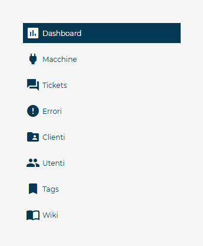
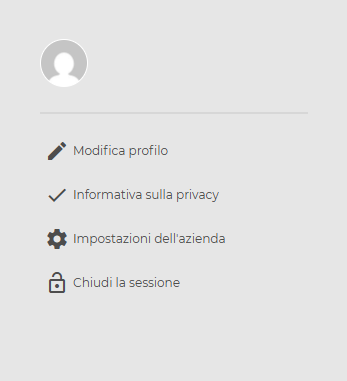

# Struttura menu di navigazione

Il **menu principale** è posizionato sul lato sinistro dell’interfaccia della piattaforma **CARIcare**.
Consente l’accesso diretto alle principali aree operative e rimane sempre visibile durante la navigazione.
La struttura è suddivisa in tre aree funzionali: **intestazione**, **navigazione** e **profilo utente**.

---

## Intestazione

Nella parte superiore del menu sono presenti il **logo CARIcare** e l’icona della **campanella delle notifiche**.

<kbd></kbd>

### Logo CARIcare

Il logo, posizionato al centro dell’intestazione, funge da collegamento rapido alla **Dashboard**.
Facendo clic sull’icona, l’utente viene reindirizzato automaticamente alla pagina iniziale della piattaforma.

### Notifiche

L’icona della campanella segnala la presenza di nuove notifiche relative ad attività o eventi di sistema.
Quando è visibile un indicatore rosso, significa che sono presenti notifiche non ancora lette.
Selezionando l’icona si apre l’elenco delle comunicazioni recenti (es. errori macchina o operazioni completate).

---

## Sezione di navigazione

La parte centrale del menu contiene le voci principali per la gestione delle attività operative.
Ogni voce è accompagnata da un’icona rappresentativa e da un’etichetta testuale.

<kbd></kbd>

### Dashboard

Visualizza una panoramica generale dei dati principali, come lo stato delle macchine e le statistiche operative.

### Macchine

Permette di consultare l’elenco delle macchine connesse e accedere ai dettagli tecnici di ciascun dispositivo.

### Tickets

Contiene tutte le segnalazioni di assistenza attive e chiuse.
Da questa sezione è possibile aprire nuovi ticket o aggiornare quelli esistenti.

### Errori

Mostra l’elenco degli errori registrati dalle macchine, con possibilità di filtrare e analizzare le cause.

### Clienti

Gestisce i dati anagrafici dei clienti associati all’account aziendale.

### Utenti

Consente la gestione dei profili utente, dei ruoli e delle relative autorizzazioni di accesso.

### Tags

Visualizza i tag configurati per la classificazione delle macchine o dei componenti.

### Wiki

Apre la documentazione tecnica **CARIcare Wiki**, utile per la consultazione di guide e procedure operative.

---

## Sezione profilo utente

La parte inferiore del menu laterale raccoglie le funzioni associate all’account personale.

<kbd></kbd>

### Modifica profilo

Permette di aggiornare i dati personali e le credenziali di accesso.

### Informativa sulla privacy

Visualizza le informazioni relative al trattamento dei dati personali.

### Impostazioni dell’azienda

Visualizza il contatto di riferimento Service Vea Group

### Chiudi la sessione

Esegue la disconnessione dalla piattaforma e termina la sessione in corso.