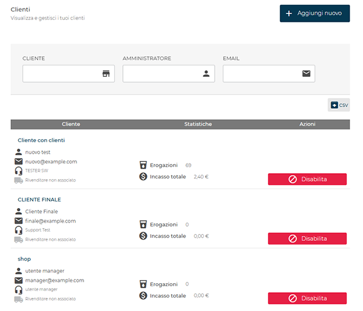
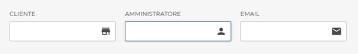
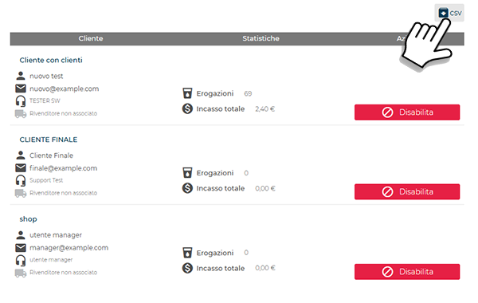
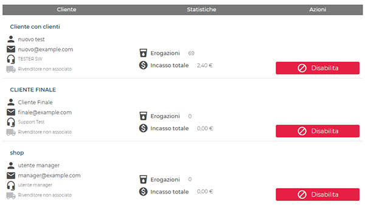
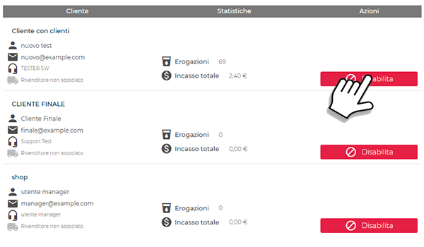
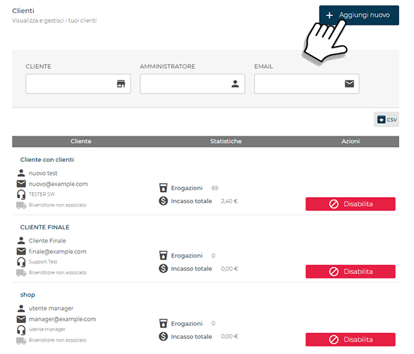
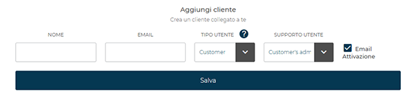
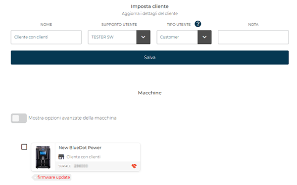
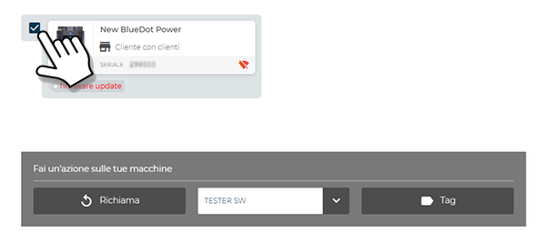

# Gestione clienti

La sezione **Clienti** consente di **visualizzare**, **aggiungere** e **disabilitare** i clienti associati.

<kbd></kbd>

## Panoramica

* **Filtri**: *Cliente*, *Amministratore*, *Email*.

<kbd></kbd>

* **Esportazione**: pulsante **CSV** per scaricare l’elenco mostrato.

<kbd></kbd>

* **Tabella clienti**:

<kbd></kbd>

  * **Cliente**: ragione sociale, referente, email e tipologia (es. rivenditore/non associato).
  * **Statistiche**: **Erogazioni** e **Incasso totale**.
  * **Azioni**: pulsante **Disabilita**.

## Disabilitazione cliente

Per rendere inattivo un cliente usare **Disabilita** nell’elenco.

<kbd></kbd>

## Aggiunta di un nuovo cliente

Per creare un cliente selezionare **Aggiungi nuovo**.

<kbd></kbd>

Nella pagina **Aggiungi cliente** compilare:

<kbd></kbd>

1. **Nome**
2. **Email**
3. **Tipo utente**:
    * **Customer**: autorizzato a creare e gestire i propri clienti
    * **End Customer**: accesso limitato, non può avere clienti
4. **Supporto utente** (referente del servizio di assistenza)
5. **Email Attivazione** (opzionale, se selezionato vengono inviate via email le credenziali di accesso)

Confermare con **Salva**.

## Imposta cliente

Cliccando sul nome di un cliente già presente in elenco, si apre la finestra **Imposta cliente**, che consente di **aggiornare i dati associati** e **gestire le macchine collegate**.

<kbd></kbd>

In questa schermata è possibile:

* **Modificare** i campi *Nome*, *Tipo utente*, *Supporto utente* o aggiungere una *Nota*.
* **Visualizzare** le macchine collegate al cliente, con i relativi dettagli (nome macchina, numero di serie, stato del firmware).
* **Attivare** la voce *Mostra opzioni avanzate della macchina* per eseguire rapidamente operazioni come l’assegnazione a un utente di supporto o il richiamo di una macchina specifica.

Selezionando una o più macchine, diventano disponibili ulteriori azioni:

<kbd></kbd>

* **Richiama** – consente di trasferire una o più macchine sotto la gestione diretta del proprio account.
* **Assegna utente di supporto** -  consente di assegnare una o più macchine selezionante a un utente di supporto.
* **Tag** – permette di aggiungere, modificare o rimuovere le etichette identificative associate alle macchine.

Premere **Procedi** per applicare le modifiche alle macchine selezionate. Premere **Cancella** per annullare le operazioni.
