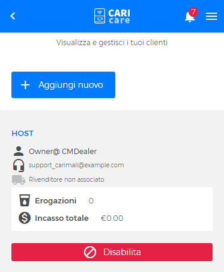
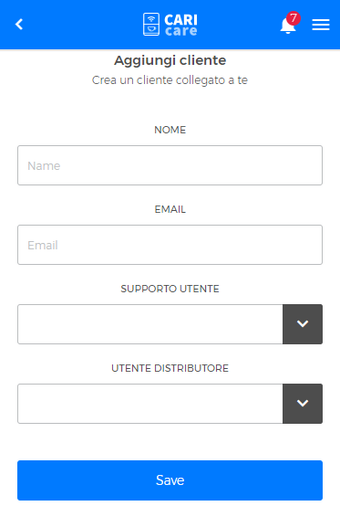

# Gestisci clienti

In questa sezione puoi **visualizzare**, **aggiungere** o **disabilitare** i clienti.

## Aggiungi un nuovo cliente

Per **aggiungere un nuovo cliente** premi sul bottone **"Aggiungi nuovo"**. 

<kbd></kbd>

Nella pagina "Aggiungi cliente/Crea cliente collegato a te" completa i campi "nome" ed "email". Scegli un supporto da assegnare al cliente, selezionandolo dal menù a tendina **"supporto utente"**; *inserire parte su utente distributore*. Premi "Salva" per memorizzare i dati inseriti.

<kbd></kbd>

## Disabilita cliente

Per disabilitare un cliente premi sul bottone "Disabilita".

<kbd></kbd>

