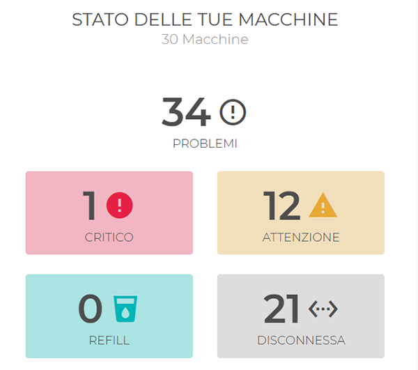
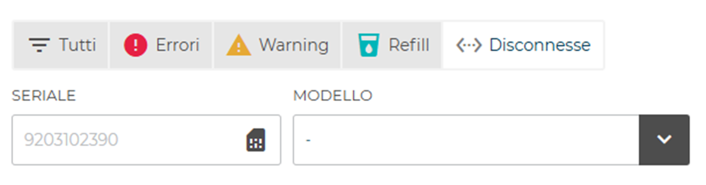
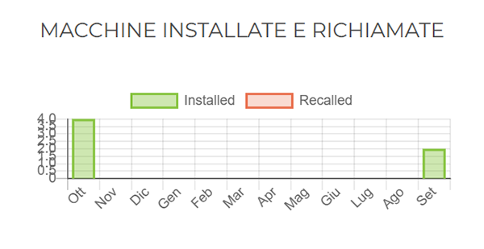
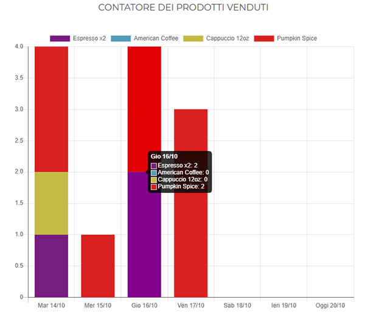
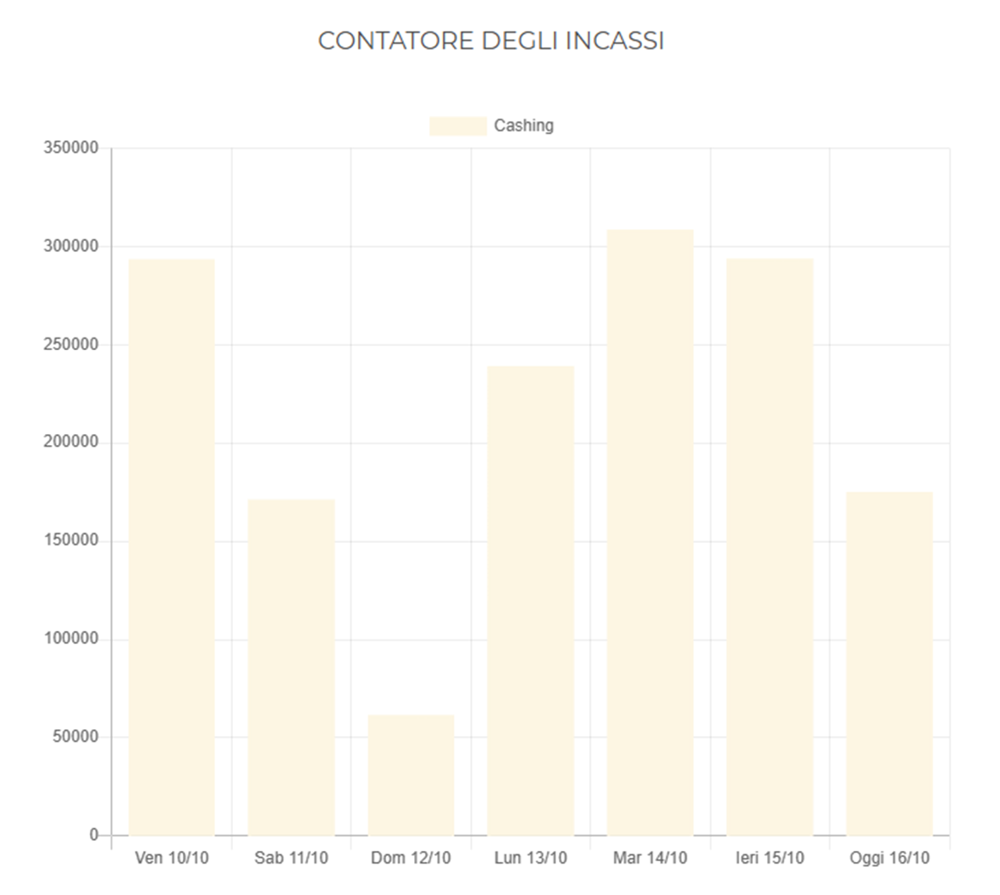

# Dashboard

La **Dashboard** ti permette di ottenere una **panoramica sullo stato delle tue macchine, sul rapporto tra macchine installate e richiamate nonché sui prodotti venduti**.

## Stato delle tue macchine

Il primo riquadro di visualizzazione riguarda **lo stato attuale delle tue macchine**. In esso è mostrato il numero complessivo delle macchine, il numero totale dei problemi riscontrati, diviso nelle tipologie "critico", "attenzione", "refill" e disconnessa", ognuno nel proprio **"box errore"**.

<kbd></kbd>

Cliccando su uno dei **"box errore"** si accede direttamente alla sezione **Errori** (per maggiori dettagli vedi par. [**Errori"](https://carimali.github.io/wiki/#/docs-it/errori) )

<kbd></kbd>

     
 ## Macchine installate e richiamate
 
 Il grafico relativo alle Macchine Installate e Richiamate (o disinstallate) mostra con due diverse colorazioni il **numero di unità installate e richiamate nell'ultimo anno**.
 
 <kbd></kbd>
 
 **Nota:** questo grafico è particolarmente utile per avere un colpo d'occhio sul rapporto tra le due tipologie di unità.
 
 

 
 ## Contatore dei prodotti venduti
 
 Il grafico relativo al **Contatore dei Prodotti venduti** offre una panoramica delle unità di prodotto vendute nell'ultima settimana. Ogni tipologia di prodotto è contraddistinta da un colore diverso. 
 
 
 Cliccando su ogni singola colonna è mostrato il dettaglio dei singoli prodotti venduti in quella giornata.
 
 <kbd></kbd>
 
Cliccando su un singolo prodotto della legenda è possibile escluderlo dalla visualizzazione.

 <kbd></kbd> 
