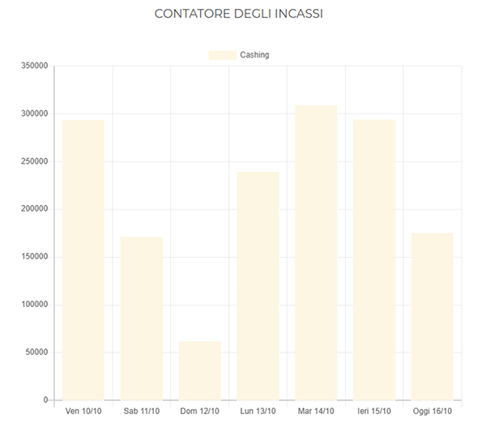

# Dashboard

La **Dashboard** fornisce una **panoramica completa e aggiornata** sullo stato delle macchine, sul rapporto tra **unità installate e richiamate**, e sui **prodotti venduti**.
Le informazioni sono presentate attraverso sezioni grafiche che consentono di monitorare in modo immediato l’andamento operativo e le eventuali anomalie.

---

## Stato delle macchine

La prima sezione mostra **lo stato complessivo delle macchine connesse alla piattaforma**.
Sono indicati il **numero totale di macchine**, il **conteggio delle anomalie rilevate** e la loro suddivisione per tipologia:

* **Critico**
* **Attenzione**
* **Refill**
* **Disconnessa**

Ogni categoria è rappresentata da un apposito **box di stato**.

<kbd></kbd>

Selezionando un box di stato, l’utente accede direttamente alla sezione **Errori** per la consultazione dettagliata delle anomalie (vedere la pagina [**Errori**](https://carimali.github.io/wiki/#/docs-it/errori) per ulteriori informazioni).
In questa sezione i diversi tipi di errore sono organizzati in tab dedicati.

---

## Macchine installate e richiamate

La seconda sezione presenta il **grafico relativo alle macchine installate e richiamate (disinstallate)**.
Il grafico mostra, con due colorazioni distinte, il **numero di unità installate e richiamate negli ultimi dodici mesi**.

<kbd></kbd>

**Nota:** questo grafico consente di analizzare rapidamente il **rapporto tra installazioni e richiami**, fornendo un’indicazione immediata sull’evoluzione del parco macchine.

---

## Prodotti venduti

La terza sezione visualizza il **grafico dei prodotti venduti**, che riassume le **vendite complessive registrate dalle macchine negli ultimi sette giorni**.
Ogni tipologia di prodotto è identificata da un colore differente per una lettura rapida e intuitiva.

Selezionando una singola colonna del grafico, vengono mostrati i **dettagli dei prodotti venduti** nella giornata corrispondente.

<kbd></kbd>

È inoltre possibile **escludere un prodotto** dalla visualizzazione selezionandolo o deselezionandolo nella legenda.

## Contatore degli incassi

L’ultima sezione della **Dashboard** mostra il **grafico del contatore degli incassi**, che rappresenta i ricavi complessivi generati dalle macchine in un determinato periodo di tempo.
I dati sono visualizzati tramite **colonne verticali**, ognuna delle quali corrisponde a una giornata.

L’asse orizzontale riporta i **giorni di riferimento**, mentre l’asse verticale mostra gli **importi incassati**.
Il colore uniforme delle colonne consente di identificare rapidamente l’andamento giornaliero degli incassi e individuare eventuali variazioni significative.

<kbd></kbd>

Cliccando su una singola colonna è possibile visualizzare il **dettaglio degli incassi relativi alla giornata selezionata**.
Il grafico offre così una visione chiara e immediata dell’andamento economico delle macchine collegate alla piattaforma **CARIcare**.