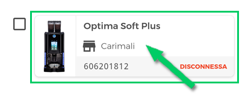

# Visualizzazione Errori

In questa sezione abbiamo un dettaglio dei singoli presenti in una data macchina.
Ogni messaggio di errore presenta il numero della macchina, la tipologia di errore (es. il simbolo "<...>" indica che la macchina è disconnessa) e quando si è verificato.

<kbd></kbd>

## Segnalazione Errori

Per segnalare un errore clicchiamo sul bottone **"crea ticket"** e accediamo alla pagina di segnalazione.

<kbd></kbd>

Cliccando sul bottone **"opzioni"** è mostrato il box della macchina oggetto della segnalazione.

