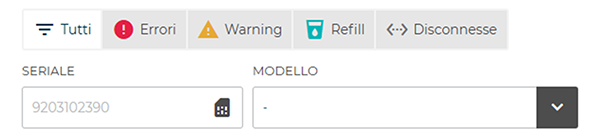
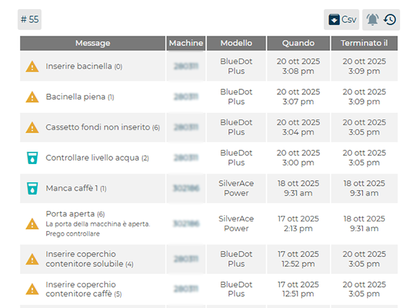
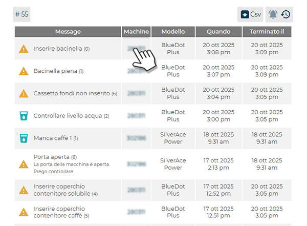

# Visualizzazione errori

La sezione **Errori** consente di visualizzare e gestire nel dettaglio tutte le **anomalie rilevate sulle macchine connesse alla piattaforma CARIcare**.
Per ciascun errore vengono indicati il **numero seriale della macchina**, la **tipologia di anomalia**, il **modello di riferimento** e la **data o ora di rilevazione**.
Ad esempio, il simbolo **<...>** indica che la macchina risulta **disconnessa**.

<kbd></kbd>

---

## Filtri e funzioni di ricerca

Nella parte superiore della schermata sono presenti diversi strumenti di filtro che consentono di **organizzare e analizzare gli errori registrati**.

* **Box di filtro tipologia:** permettono di selezionare la categoria di errore da visualizzare:

  * **Tutti** (elenco completo) 
  * **Errori** (gravi)
  * **Warning** (avvisi)
  * **Refill** (mancanze di prodotto)
  * **Disconnesse** (macchine non collegate).

<kbd></kbd>

* **Seriale:** consente di filtrare gli errori in base al **numero seriale** della macchina.

* **Modello:** consente di filtrare i risultati per **i modelli presenti nel proprio parco macchine** (ad esempio *BlueDot*, *SilverTwin*, *Armonia*).

* **#34:** indica il **numero degli errori**.

* **CSV:** consente di **esportare i dati degli errori** in un file **.csv** per analisi o archiviazione esterna.

<kbd></kbd>

---

## Modalità di visualizzazione allarmi

Gli allarmi possono essere visualizzati in **due modalità distinte**:

 mostra **tutti gli allarmi attivi** in tempo reale, senza limiti temporali.
  Questa modalità consente di monitorare lo stato corrente delle macchine e intervenire rapidamente sulle anomalie in corso.

  <kbd></kbd>

 apre lo **storico degli allarmi**, che include anche gli **errori risolti o terminati**.
  All’interno dello storico sono disponibili ulteriori **filtri avanzati**:

  * **Status:** consente di distinguere tra allarmi **aperti** (ancora da risolvere) e **chiusi** (già risolti).
  * **Data:** permette di filtrare gli eventi in base al periodo, selezionando tra:

    * **Ultima settimana**
    * **Ultime due settimane**
    * **Ultimo mese**
    * **Ultimi tre mesi**

<kbd></kbd>

Queste due modalità offrono una visione completa e dinamica dello stato operativo delle macchine, consentendo di passare rapidamente dal monitoraggio in tempo reale all’analisi storica delle anomalie.

 esporta lo storico degli errori in formato CSV.

---

## Tabella degli errori

La parte inferiore della schermata presenta una **tabella riepilogativa** che mostra, per ogni errore registrato:

* **Messaggio:** descrizione sintetica dell’anomalia (es. *Controllare livello acqua*).
* **Machine:** numero identificativo della macchina.
* **Modello:** modello della macchina interessata.
* **Quando:** data e ora di rilevazione.
* **Terminato il:** data e ora di chiusura (se disponibile).

Questa tabella consente di **monitorare lo stato operativo delle macchine** e di **tracciare la cronologia completa delle anomalie** registrate nella piattaforma.

<kbd></kbd>

---

## Collegamento alla pagina “Scheda macchina”

Selezionando il **numero seriale della macchina** nella tabella, viene aperta automaticamente la pagina **Scheda macchina** relativa a quella macchina.
Da questa sezione è possibile consultare nel dettaglio tutti gli **eventi, allarmi e dati operativi** associati, per analisi tecniche o verifiche approfondite.

<kbd></kbd>