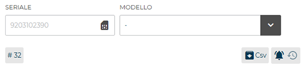

# Visualizzazione Errori

In questa sezione abbiamo un **dettaglio degli errori presenti in una data macchina**.
Ogni messaggio di errore presenta il **numero della macchina, la tipologia di errore (es. il simbolo "<...>" indica che la macchina è disconnessa) e quando si è verificato**.

<kbd></kbd>

Puoi scegliere se visualizzare tutti gli errori o un solo tipo di errore cliccando sul simbolo corrispondente della barra in alto.

<kbd></kbd>

## Segnalazione Errori

Per segnalare un errore clicchiamo sul bottone **"crea ticket"** e accediamo alla pagina di segnalazione.

<kbd></kbd>

Il ticket mostra il destinatario del supporto, oltre all'argomento della segnalazione e alla data di creazione.

<kbd></kbd>

Cliccando sul bottone **"opzioni"** è mostrato il box della macchina oggetto della segnalazione.

