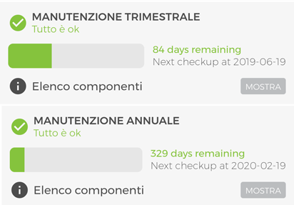
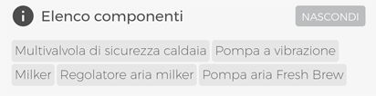
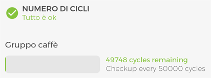
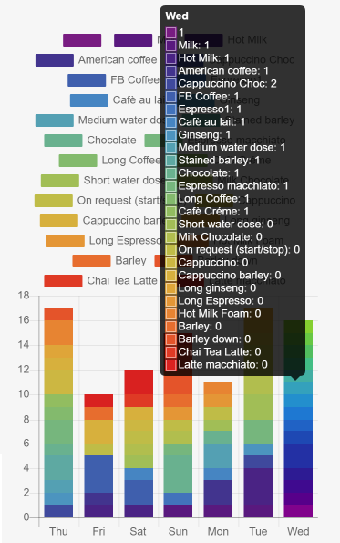
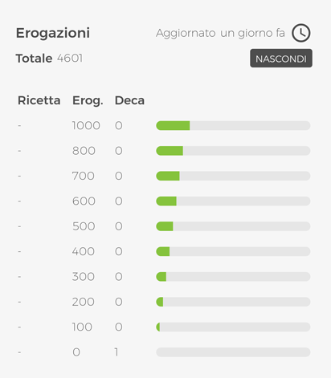
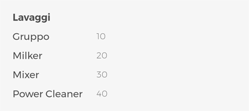

# Stato della Macchina

Accedi a questa sezione cliccando all'interno del riquadro di una macchina: 

<kbd></kbd>

da questo momento in poi tutte le informazioni visualizzate saranno strettamente legate alla macchina selezionata.
In quest'area trovi le **tre schede** che seguono:

## Manutenzione

<kbd></kbd>

In questa sezione, puramente informativa, puoi vedere:
     
- Quanto tempo manca alle **manutenzioni programmate**. I tempi di manutenzione cambiano da modello a modello e fanno riferimento a quelli suggeriti nel manuale del prodotto. Una barra di progresso con colori differenti (verde, giallo, rosso) si riempirà giorno dopo giorno partendo dal "giorno uno" fino a quando sarà trascorso il periodo consigliato; a quel punto verrà inviata un'e-mail di notifica **"manutenzione necessaria"** al supporto indicato per quella macchina. 

<kbd></kbd>

Premi il pulsante **"mostra"** situato subito sotto ciascuna barra di progresso per vedere quali componenti è necessario sostituire durante la manutenzione.

<kbd></kbd>

- Il **numero di cicli totali compiuti dal gruppo caffè**, una barra di progresso con colori differenti (verde, giallo, rosso) indicherà lo stato di usura del componente che, una volta raggiunto il suo numero di cicli massimo, dovrà essere sostituito, verrà invita un e-mail di notifica "verifica gruppo" al supporto indicato per la macchina.

<kbd></kbd>

- Il **numero di erogazioni** nelle ultime 24 ore sul **totale massimo giornaliero consigliato** (numero consumazioni / erogazioni massime consigliate). Lo scopo è quello di evidenziare se una macchina da caffè viene utilizzata al di sopra delle proprie possibilità, per evitare degrado di qualità dei prodotti e rapido deterioramento o rottura dei componenti.
     
- Un **grafico** che mostra la **quantità di bevande erogate negli ultimi sette giorni** divise per nome bevanda.

 <kbd></kbd>

- Totale delle **erogazioni**. Premi **"Mostra"** per visualizzare le erogazioni divise per nome bevanda.

<kbd></kbd>

- I **Lavaggi**.

<kbd></kbd>

- **Extra Milk** (se disponibile per quella macchina).

- L'**Incasso totale** delle erogazioni.

     
 ## Ricette
 
 <kbd></kbd>
 
 In questa sezione puoi:
 
 - **Importare/Esportare un set di ricette**. Premi **"Salva le ricette"** per aggiungere il set di ricette attualmente in macchina nell'elenco a tendina **Carica ricette**. 

Scegli un set dall'elenco a tendina per caricarlo su una macchina. 

**Nota**: i set di ricette creati sono visibili da tutti gli utenti del vostro gruppo, se in possesso di un livello di autorizzazione adeguato.

- **Visualizzare/Modificare lo stato delle singole ricette**, incluso abilitare/disabilitare, cambio icona e, se previsto dalla configurazione prezzo e tipo di bicchiere. 
Premi su una ricetta per accedere alla sua configurazione. 

<kbd></kbd>

Puoi modificare ogni singolo parametro proprio come fossi di fronte alla macchina da caffè, per tutte le informazioni relative a come impostare i parametri fai riferimento al manuale d'uso, premi **"Salva modifiche"** prima di lasciare quest'area altrimenti le modifiche andranno perse.   
 
 
 ## Impostazioni
 
 <kbd></kbd>
 
  In questa sezione puoi:
  
  - **Cambiare la lingua della macchina**. Seleziona la lingua desiderata dal menù a tendina **"Lingua principale"**. 
  Se previsto dal modello, puoi anche modificare la lingua secondaria: selezionala dal menù a tendina **"Seconda lingua"**.
  
  <kbd></kbd>
  
  - **Impostare una Soglia allarme caffè**. Questa funzione consente di assegnare una certa **QUANTITÀ CAFFÈ (KG)** a ciascuna macchina e ricevere due avvisi **EMAIL**: uno quando il consumo di caffè sta per raggiungere la quantità impostata **SOGLIA CAFFÈ (%)**; un altro quando la **QUANTITÀ CAFFÈ (KG)** viene interamente consumata. 
Una volta impostati i parametri, premi **"Salva soglia allarme caffè"** per attivare la funzionalità. 

<kbd></kbd>

**Nota**: una volta attiva la funzionalità, i parametri non potranno più essere modificati fino a quando la quantità di caffè non sarà interamente consumata. 

