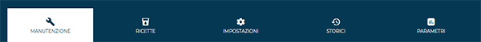
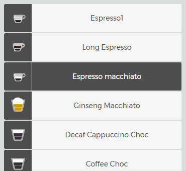

# Stato della Macchina

La sezione **Stato della Macchina** consente di visualizzare tutte le informazioni operative relative a una singola macchina collegata a **CARIcare**.

Per accedere alla sezione, selezionare il riquadro  corrispondente alla macchina desiderata.

<kbd></kbd>

Da questo momento in poi, tutti i dati visualizzati faranno riferimento esclusivo alla macchina selezionata.
L’interfaccia è composta da tre schede principali:

* **Manutenzione**
* **Ricette**
* **Impostazioni**
* **Storici**
* **Parametri** (Solo per linea SilverAce con ultima versione firmware)

---

## Manutenzione

<kbd></kbd>

La scheda **Manutenzione** è un’area informativa che riporta lo stato dei componenti e le scadenze delle manutenzioni programmate.
Le informazioni disponibili includono:

### Modulo Erogazioni

Il modulo **Erogazioni** consente di analizzare in dettaglio l’attività di erogazione della macchina selezionata.
I dati vengono rappresentati in forma grafica per facilitare il monitoraggio delle bevande distribuite in un determinato periodo.

<kbd></kbd>

#### Struttura del modulo

Il modulo è composto da tre sezioni principali:

* **Filtri temporali e di selezione**
* **Grafico delle erogazioni**
* **Strumenti di esportazione**

#### Filtri temporali e di selezione

Nella parte superiore sono presenti i campi per impostare il periodo e i criteri di analisi:

* **Intervallo di tempo**
  Permette di selezionare il periodo da analizzare (ultima settimana, ultime due settimane, ultimo mese, periodo personalizzato).
  Il filtro viene applicato automaticamente al grafico una volta premuto **Seleziona date**.

* **Seleziona ricette**
  Consente di limitare la visualizzazione a una o più ricette specifiche tra quelle presenti nella macchina.

* **Tipo di erogazione**
  Permette di filtrare per erogazioni *online* e *offline*

#### Grafici delle erogazioni

Il modulo **Erogazioni** presenta due grafici complementari che mostrano le stesse informazioni su scale temporali differenti, consentendo un’analisi completa dell’attività della macchina.

**Grafico 1**

Rappresenta la quantità totale di bevande erogate per giorno nel periodo selezionato.
Ogni colonna indica una giornata, mentre i colori identificano le diverse ricette o tipologie di bevanda.

* L’asse **orizzontale** mostra i giorni compresi nell’intervallo selezionato.
* L’asse **verticale** riporta il numero totale di erogazioni.

Questo grafico consente di valutare l’andamento generale dell’attività, evidenziando variazioni nel consumo e nei volumi di erogazione nel corso della settimana o del mese.

<kbd></kbd>

**Grafico 2**

Mostra la distribuzione delle bevande erogate durante le diverse ore della giornata.
Ogni colonna rappresenta un’ora (da 00:00 a 23:00), e la suddivisione cromatica consente di distinguere le diverse tipologie di bevande.

<kbd></kbd>

Questo grafico permette di:

* Identificare le **fasce orarie di maggiore utilizzo** della macchina.
* Analizzare i **picchi di consumo** in relazione al tipo di bevanda erogata.
* Pianificare in modo più efficiente **manutenzioni** o **rifornimenti** in base agli orari di massimo carico operativo.

#### Strumenti di esportazione e analisi

Sotto il grafico **1** sono presenti tre pulsanti di funzione:

* **Raggruppa per ricette**
  Riorganizza il grafico e i dati visualizzati mostrando le erogazioni aggregate per singola ricetta, anziché per data.

* **Esporta dati di erogazione in CSV**
  Genera un file **CSV** contenente i dati dettagliati delle erogazioni (ricetta, quantità, data e ora).
  Il file può essere utilizzato per analisi statistiche o integrazione con sistemi gestionali esterni.

* **Esporta contatori in CSV**
  Crea un file **CSV** con i contatori globali e parziali della macchina nel periodo selezionato.
  Utile per verificare il consumo complessivo e l’attività operativa in un intervallo definito.

---

### Temperature

<kbd></kbd>

Il modulo **Temperature** mostra in tempo reale le temperature rilevate dai sensori principali della macchina:

* **Caffè** – Temperatura della caldaia caffè.
* **Vapore** – Temperatura della caldaia vapore.

Le informazioni sono aggiornate periodicamente e consentono di verificare la stabilità termica del sistema.
Un valore anomalo può indicare un malfunzionamento del gruppo caffè o del circuito di riscaldamento.

---

### Erogazioni

<kbd></kbd>

Il modulo **Erogazioni** visualizza i dati relativi al numero di bevande distribuite:

* **Contatore Globale** – Numero totale di erogazioni effettuate dalla macchina.
* **Contatore Parziale** – Numero di erogazioni registrate dall’ultimo azzeramento.

Premendo **Mostra**, è possibile visualizzare il dettaglio completo delle erogazioni suddivise per tipologia di bevanda.
I dati sono aggiornati automaticamente a intervalli regolari.

---

### Lavaggi

<kbd></kbd>

Il modulo **Lavaggi** riporta il numero di cicli di lavaggio effettuati dai vari componenti della macchina:

* **All in One** – Numero complessivo di cicli completi.
* **Gruppo** – Cicli di lavaggio eseguiti sul gruppo caffè.
* **Milker** – Cicli di lavaggio del sistema latte.
* **Mixer** – Cicli di lavaggio dei miscelatori interni.

Queste informazioni permettono di monitorare la corretta esecuzione delle operazioni di manutenzione ordinaria.

---

### Calibrazioni

<kbd></kbd>

Il modulo **Calibrazioni** mostra i valori correnti di taratura relativi ai dosatori della macchina:

* **Macinino 1 / 2** – Quantità di caffè macinato per secondo (*gr/s*).
* **Solubile 1 / 2** – Quantità di prodotto solubile dosata per secondo (*gr/s*).

I valori di calibrazione consentono di controllare la coerenza tra le impostazioni del software e la resa effettiva dei prodotti, garantendo costanza qualitativa e corretto dosaggio.

---

### Mappa e indirizzo

<kbd></kbd>

Il modulo **Mappa e indirizzo** mostra la **posizione geografica della macchina** visualizzata nella scheda di stato.
L’area utilizza l’integrazione con **Google Maps** per fornire una localizzazione precisa e interattiva del punto di installazione.

La mappa può essere visualizzata in due modalità:

* **Mappa** – Mostra la vista standard con strade, luoghi e riferimenti principali.
* **Satellite** – Mostra la vista satellitare con immagini reali del territorio.

Sotto la mappa è riportato l’**indirizzo completo di installazione**, comprensivo di via, numero civico, città e codice postale.
Il pulsante **Naviga** apre la posizione direttamente nell’applicazione di navigazione predefinita del dispositivo.

Premendo **Cambia indirizzo**, è possibile aggiornare la posizione associata alla macchina, ad esempio in caso di spostamento o nuova installazione.
L’aggiornamento viene memorizzato automaticamente nella piattaforma e riflesso in tempo reale sulla mappa.

---

### Manutenzione trimestrale

<kbd></kbd>

Il modulo **Manutenzione trimestrale** mostra il tempo rimanente prima dell’intervento di manutenzione periodica.
La barra di avanzamento rappresenta il progresso dei giorni trascorsi rispetto al periodo di riferimento (90 giorni).

* **Tutto è OK**: la macchina è entro il periodo operativo sicuro.
* **Giorni rimanenti**: indica il numero di giorni prima del prossimo checkup programmato.
* **Azzera contatore**: consente di ripristinare il contatore dopo l’esecuzione della manutenzione.

  > L’azione non è reversibile.

Il prossimo intervento viene pianificato automaticamente in base alla data mostrata accanto alla barra di stato.

---

### Manutenzione annuale

<kbd></kbd>

Il modulo **Manutenzione annuale** segue lo stesso principio della manutenzione trimestrale, ma fa riferimento al controllo periodico su base annuale (365 giorni).
Mostra la **data del prossimo checkup**, i **giorni rimanenti** e la **barra di avanzamento temporale** che indica il livello di completamento del periodo operativo.

Anche in questo caso, il pulsante **Azzera contatore** deve essere utilizzato al termine dell’intervento per ripristinare il ciclo di monitoraggio.

---

### Numero di cicli

<kbd></kbd>

Il modulo **Numero di cicli** tiene traccia del numero complessivo di **cicli di erogazione effettuati dal gruppo caffè**.
La barra di avanzamento mostra il numero di cicli eseguiti rispetto alla soglia di manutenzione prevista.

* **Cicli rimanenti**: indica quanti cicli mancano al raggiungimento del limite impostato (ad esempio, 50.000).
* Al superamento della soglia, la macchina richiede una verifica del gruppo erogatore o la sostituzione dei componenti soggetti a usura.

---

### Erogazioni nelle ultime 24 ore

<kbd></kbd>

Il modulo **Erogazioni nelle ultime 24 ore** confronta il numero di bevande effettivamente erogate con il **limite massimo giornaliero consigliato**.
Il rapporto viene mostrato sia numericamente (es. 108/200) sia tramite una barra di avanzamento.

Questo modulo consente di monitorare il **livello di utilizzo giornaliero** della macchina e individuare eventuali **sovraccarichi operativi** che potrebbero compromettere la qualità delle erogazioni o ridurre la vita utile dei componenti.

---

### Consumo prodotti

Il modulo **Consumo prodotti** visualizza il livello di utilizzo dei prodotti erogati dalla macchina (caffè in grani e prodotti solubili).
I dati vengono mostrati tramite **grafici ad anello**, che evidenziano la **percentuale utilizzata** e quella **rimanente** per ciascun contenitore.

<kbd></kbd>

Ogni anello rappresenta un singolo componente della macchina:

* **Macinino 1 / Macinino 2** – Indicano la quantità di caffè in grani utilizzata dai rispettivi macinini.
* **Solubile 1** – Indica la quantità di prodotto solubile (es. cioccolata o latte in polvere) consumata.

La legenda sotto ciascun grafico distingue chiaramente:

* **Utilizzato (in rosso)** – Percentuale di prodotto già erogata.
* **Rimanente (in verde)** – Percentuale di prodotto ancora disponibile.

Un **triangolo arancione di avviso** accanto al nome del componente segnala che il relativo contatore ha raggiunto o superato il limite impostato.
In questo caso, è necessario procedere con il **reset del contatore**.

#### Azzeramento contatori

Cliccando sull’icona di **avviso (triangolo arancione)** accanto a un componente, si apre una finestra di conferma che consente di **azzerare i contatori di consumo** per i prodotti selezionati.

<kbd></kbd>

Viene mostrato l’elenco dei componenti per i quali è possibile eseguire l’operazione:

* Macinino 1
* Macinino 2
* Solubile 1

Premendo **Conferma**, il sistema azzera i valori di consumo e ripristina il conteggio per i cicli successivi.
Il pulsante **Cancella** consente invece di annullare l’operazione senza apportare modifiche.

> ⚠️ **Attenzione:** l’azzeramento dei contatori è un’azione permanente e non può essere annullata.
> È consigliato eseguirla solo dopo il reale rifornimento dei prodotti.

---

## Ricette

  <kbd></kbd>

La scheda **Ricette** consente di gestire le ricette installate sulla macchina, modificare i parametri di erogazione, esportare o importare configurazioni e inviare le modifiche direttamente al dispositivo connesso.

### Struttura del menu

La parte superiore mostra la macchina selezionata e il menu a tendina **Importare un set di ricette**, da cui è possibile caricare un set precedentemente salvato.

<kbd></kbd>

Sotto è visibile una finestra che mostra le **ricette disponibili** (*abilitate* e *disabilitate*), visualizzabili in due modalità:

* **Vista griglia**: anteprime grafiche delle bevande, corrisponde alla visualizzazione lato utente in macchina.
* **Vista elenco**: con visualizzazione testuale ordinata.

È possibile definire il **numero di ricette per pagina** e selezionare una specifica bevanda per modificarne i parametri.
Attivando l’opzione **Mostra disabilitate**, vengono visualizzate anche le ricette momentaneamente non abilitate.

<kbd></kbd>

### Parametri generali della ricetta

La parte superiore della scheda di configurazione contiene i **parametri comuni a tutte le ricette**, indipendentemente dal tipo di bevanda o modello di macchina.

<kbd></kbd>

* **Etichetta**
  Indica il **nome visualizzato** della bevanda nel menu della macchina.
  Può essere modificato liberamente per adattarsi alla lingua o alla nomenclatura del cliente (es. *Espresso corto*, *Doppio espresso*, *Latte caldo*).

* **Abilitato / Disabilitato**
  Definisce se la ricetta è **attiva** e quindi visibile all’utente sulla macchina.
  Le ricette disabilitate restano salvate nel sistema ma non appaiono nel menu principale della macchina.

* **Icona**
  Permette di selezionare l’**immagine rappresentativa** della bevanda tra quelle disponibili.
  L’icona scelta sarà mostrata sul display della macchina o nella vista ricette del portale.

* **Numero di prodotti**
  Specifica il **numero di ingredienti o componenti** coinvolti nella ricetta (ad esempio: caffè + latte, caffè + cioccolata).
  Il valore impostato influisce sui parametri successivi, che varieranno in base al numero di prodotti selezionato.

### Parametri specifici della ricetta

La parte inferiore della scheda di configurazione contiene i **parametri specifici**, che variano in base al **tipo di prodotto** selezionato nei campi generali.

<kbd></kbd>

Questi parametri definiscono il **comportamento tecnico dell’erogazione** e le **caratteristiche operative** del singolo ingrediente (ad esempio latte, caffè o prodotti solubili).
Ogni prodotto dispone di un insieme dedicato di voci.

I valori impostati determinano le **sequenze di lavoro della macchina** durante la preparazione della bevanda e influenzano direttamente la **qualità finale del prodotto erogato**.

> **Nota:** la struttura e il numero dei parametri visualizzati dipendono dal tipo di macchina e dal prodotto selezionato.
> Per una descrizione dettagliata dei singoli campi, fare riferimento al **manuale tecnico del modello**.

Le modifiche possono essere applicate direttamente dal pannello e sono equivalenti a quelle effettuabili dalla macchina fisica.
Al termine della configurazione, è necessario **salvare o inviare le modifiche** utilizzando i pulsanti presenti in basso.

### Operazioni disponibili

<kbd></kbd>

* **Salva le ricette**
  Registra il set di ricette attualmente configurato e lo aggiunge all’elenco disponibile nel menu **Importa set di ricette**.

* **Invia le ricette alla macchina**
  Trasmette in tempo reale le impostazioni modificate alla macchina selezionata, sovrascrivendo quelle precedenti.

> **Nota:** le modifiche devono essere salvate o inviate prima di uscire dalla sezione, altrimenti i dati non verranno mantenuti.

### Accessibilità e permessi

Tutti i set di ricette salvati sono condivisi tra gli utenti del gruppo CARIcare con **livello di autorizzazione adeguato**.
Le funzioni di esportazione e invio alla macchina sono riservate ai **ruoli tecnici o amministrativi** abilitati.

---

## Impostazioni

<kbd></kbd>

La scheda **Impostazioni** permette di configurare alcuni parametri generali della macchina.

Le funzioni disponibili includono:

* **Impostazione lingua**
  Consente di selezionare la **lingua principale** dal menù a tendina dedicato.
  Nei modelli che lo prevedono, è possibile impostare anche una **lingua secondaria**.

  <kbd></kbd>

* **Soglia allarme caffè**
  Permette di definire una **quantità di caffè (kg)** per ciascuna macchina e ricevere due notifiche e-mail:

  * una al raggiungimento della **soglia percentuale impostata**;
  * una quando la quantità impostata è completamente esaurita.

  Dopo aver configurato i parametri, premere **Salva soglia allarme caffè** per attivare la funzione.

  <kbd></kbd>

  **Nota:** una volta attivata la funzione, i parametri restano bloccati fino al completo esaurimento della quantità di caffè impostata.