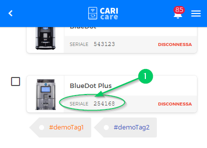
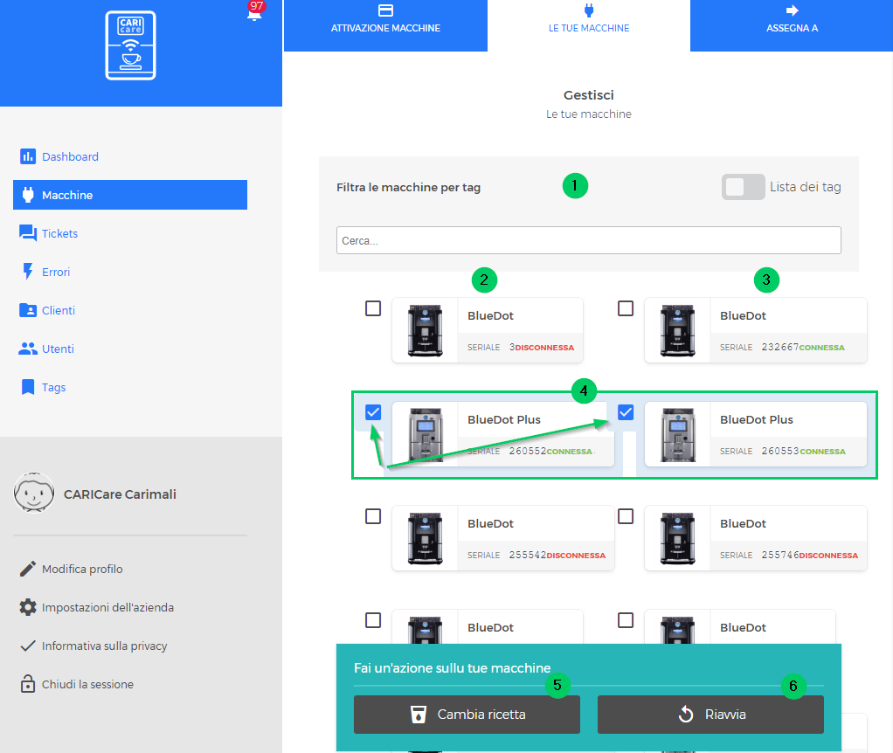

# Macchine

In quest’area si trova l’elenco delle tue macchine, tutti i comandi e le funzioni necessarie alla gestione delle stesse, quando ti trovi in ques'area tieni presente che, in CARIcare, l’identificativo univoco per ogni singola macchina è il seriale e ha corrispondenza con quello riportato sulla targhetta della macchina da caffè fatta eccezione per il _CA_ che lo precede ed è visibile in ogni singolo elemento di tipo macchina, ad esempio nel punto indicato nell'immagine con (1) il seriale è 254168.

## Le tue macchine

Nella sezione “LE TUE MACCHINE” trovi tutte le macchine da caffè compatibili con CARIcare chi ti sono state assegnate, i box alla sinistra di ciascuna macchina ti permettono di **__selezioniare__** una o più macchine contemporanemente, tutte le funzioni di questa area quando eseguite vengono applicate alla **__selezione__**.

Su ciascuna macchina oltre al seriale è riportato il modello, una miniatura, lo stato della connessione con il server CARIcare e, se assegnata, il cliente che la possiede al momento.

Hai a disposizione un filtro mediante il quale puoi restringere l'insieme di macchine visualizzate

tag: ti permette di filtrare per uno o più tag precedentemente aggiunti alle tue macchine,
per approfondimenti su come si creano e si assegnano i tag consulta l’apposita [sezione Tags](https://carimali.github.io/wiki/#/docs-it/tags)

Puoi capire facilmente se è una macchina è disconnessa (2) o connessa (3) grazie alla scritta posizionata subito a destra della matricola o selezionare una o più macchine (4) e applicare un’azione alla selezione stessa, cambiare una ricetta o l’intero set di ricette (5)  riavviare (6).

  - Filtra le macchine per tag
  - Cambia ricetta
  - Riavvia
  - Assegna

## Macchina

  - Accedi a questa sezione cliccando su una macchina, da questo momento in poi tutte le informazioni visualizzare saranno strettamente legate alla macchina selezionata

  - MANUTENZIONE
  
     In questa sezione poui vedere:
     
     - Quanto tempo manca alle manutenzioni programmate, i tempi di manutenzione cambiano da modello a modello si basano sulle stesse informazione che potete trovare all'interno del manuale.
       Una barra di progresso con colori differenti (verde, giallo, rosso) si riempirà dal primo giorno del ciclo fino alla scadenza al raggiungimento della quale verrà invita un e-mail al supporto indicato per la macchina.
       Subito sotto ogni barra premi mostra per vedere quali componenti necessario sostituire al momento della manutenzione.
       
     - Il numero di cicli totali compiuti dal gruppo caffè, una barra di progresso con colori differenti (verde, giallo, rosso) indicherà lo stato di usura del componente che una volta raggiunto il suo numero di cicli massimo dovrà essere sostituito, una volta raggiunto il massimo dei cicli verrà invita un e-mail al supporto indicato per la macchina.
     
     
     
     
     
     
  - Ricette
  - Impostazioni

