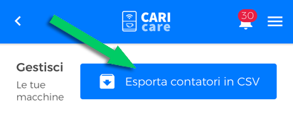
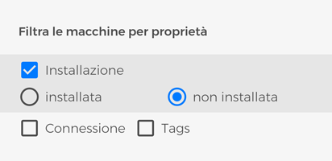
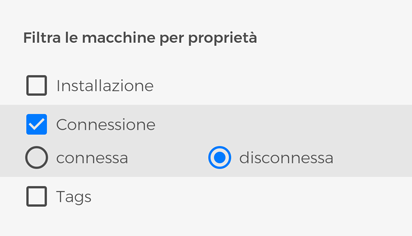
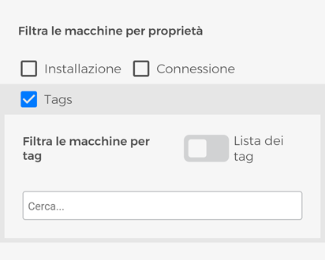
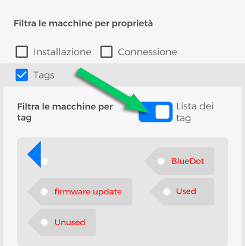
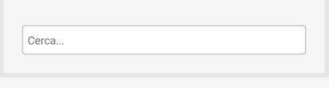
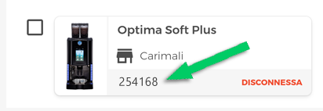
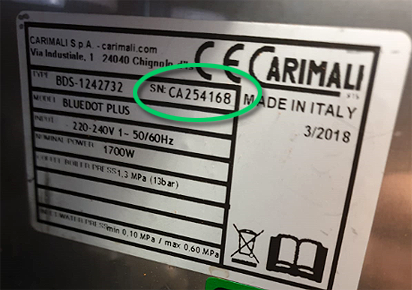
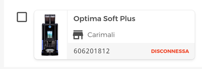

# Macchine

## Esporta Contatori in CSV

Clicca sul bottone **"Esporta contatori in CSV"** per creare un documento in formato **CSV** (Comma-Separated Values) contenente i **contatori delle tue macchine**.

<kbd></kbd>

## Filtra macchine per Proprietà

Hai a disposizione una **sezione filtro**: usala per individuare rapidamente una o più macchine, effettuando una ricerca per: 

- **Installazione**.  Cliccando il segno di spunta corrispondente, sono visualizzate solo le macchine *assegnate (installate)* o *non assegnate (non installate)*.

<kbd></kbd>

- **Connessione**. Cliccando il segno di spunta corrispondente, sono visualizzate solo le macchine *connesse* o *diconnesse*.

<kbd></kbd>

- **Tags**. Cliccando il segno di spunta corrispondente, puoi filtrare le tue macchine secondo uno o più tags che hai assegnato loro.

<kbd></kbd>

Puoi visualizzare i tags creati attivando lo switch ***Lista dei tags***

<kbd></kbd>

Inoltre, puoi filtrare per uno o più tags scrivendone il nome nel campo ***Cerca*** ; 

<kbd></kbd>
 
***Nota:** per maggiori informazioni su come si creano e si assegnano i tag consulta l’apposita [sezione Tags](https://carimali.github.io/wiki/#/docs-it/tags).*

## Azioni sulle macchine

Nella sezione **“LE TUE MACCHINE”** trovi **tutte le macchine da caffè compatibili con CARIcare** che ti sono state assegnate e alcune funzioni necessarie alla gestione delle stesse.

Come in tutto il sistema CARIcare, l’identificativo univoco per ogni singola macchina è il **seriale** e ha corrispondenza con quello riportato sulla targhetta della macchina da caffè, fatta eccezione per il **_CA_** che lo precede: per esempio, nel punto indicato nell'immagine che segue, è mostrato il seriale 254168

<kbd></kbd>

che trovi nella targhetta della macchina corrispondente:

<kbd></kbd>

Su ciascuna macchina oltre al seriale è riportato il **modello**, una **miniatura**, lo **stato della connessione** con il server CARIcare e, se **assegnata**, il **cliente** che la possiede al momento.
Il checkbox alla sinistra di ciascuna macchina ti permette di selezioniare **una o più macchine contemporanemente, tutte le funzioni di questa area quando eseguite vengono applicate alla selezione**.

<kbd></kbd>

***Nota:** puoi usare l'area filtro per affinare ulteriormente la ricerca sull'insieme di macchine visualizzate.*
\
\
  
  
## Assegnare le macchine

Dopo aver creato un cliente, puoi usare questa funzione per assegnargli le tue macchine da caffè. Che si tratti di noleggio o vendita, è un modo per organizzarle e gestire al meglio il tuo business. Una volta selezionato una o più macchine premi **Assegna a** seleziona un Cliente dal menù a tendina e premi **Salva**.
 
Ora le macchine selezionate sono assegnate e visibili anche nell'Area Macchine, sotto la sezione **Cliente** *mettere link alla pagina cliente sezione macchine*, se è stato creato un account CARIcare anche per il cliente, quest'ultimo potrà visualizzarle sotto la sezione **Macchine**.

## Gestire le ricette
 
Una volta selezionato una o più macchine scegli un set di ricette dall'elenco a tendina per caricarlo sulle macchine selezionate,
oppure premi **una ricetta** per modificarla, puoi abilitarla/disabilitarla, cambiare icona e, se previsto dalla configurazione prezzo e tipo di bicchiere, puoi modificare ogni singolo parametro proprio come fossi di fronte alla macchina da caffè, per tutte le informazioni relative a come impostare i parametri fai riferimento al manuale d'uso, premi **Salva modifiche** prima di lasciare quest'area altrimenti le modifiche andranno perse.

***Nota:** le modifiche verranno effettuate su tutte le macchine selezionate.* 

## Riavviare le macchine 

Dopo aver selezionato una o più macchine, premi **Riavvia** per riavviare le macchine selezionate.

## Assegnare un TAG alle macchine

Assegna tag alle tue macchine: premi **Tag** scrivi il/i nome/i del/i tag/s nella area di testo *Cerca..* e premi *Salva*

