# Macchine

La sezione **Macchine** consente la visualizzazione, la ricerca e la gestione delle macchine da caffè connesse alla piattaforma **CARIcare**.  
Da quest’area è possibile filtrare le macchine in base a diversi parametri, esportare i contatori, aggiornare il firmware, gestire le ricette o inviare comandi remoti.

<kbd>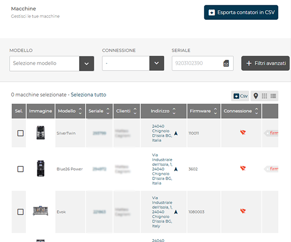</kbd>

---

## Esporta contatori in CSV

Il pulsante **Esporta contatori in CSV** genera un file in formato CSV (Comma-Separated Values) contenente i dati aggiornati dei contatori delle macchine visualizzate.  
Il file può essere utilizzato per attività di analisi, reportistica o archiviazione.

<kbd>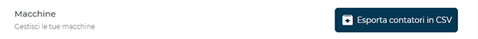</kbd>

---

## Filtri di ricerca

La parte superiore della schermata contiene un insieme di **filtri** che permettono di individuare rapidamente una o più macchine in base a criteri specifici.

I campi disponibili sono:

* **Modello** – Filtra le macchine in base al modello.
* **Connessione** – Permette di selezionare macchine *connesse* o *disconnesse*.
* **Seriale** – Ricerca diretta tramite numero seriale univoco.

Il pulsante **Filtri avanzati** consente di espandere o ridurre i criteri disponibili.

Campi aggiuntivi:

* **Cliente** – Mostra le macchine associate a un cliente specifico.
* **Indirizzo** – Consente la ricerca per ubicazione.
* **Firmware** – Filtra per versione firmware installata.
* **Tags** – Filtra in base ai tag assegnati (es. **Firmware update**).

<kbd>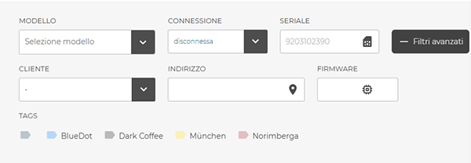</kbd>

---

## Elenco macchine

La parte inferiore della pagina mostra la **lista delle macchine** con i principali dati operativi, disponibile in tre modalità di visualizzazione.

### Vista a elenco

Mostra le macchine in formato tabellare, una per riga.

Ogni voce include:

* **Immagine**
* **Modello**
* **Seriale**
* **Cliente**
* **Indirizzo di installazione**
* **Versione firmware**
* **Stato connessione**
* **Tags**
* **Azioni**

<kbd>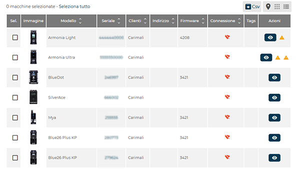</kbd>

---

### Vista a griglia

Mostra le macchine in formato scheda, con layout compatto.  
Questa modalità facilita il riconoscimento visivo grazie all’immagine del modello.

<kbd>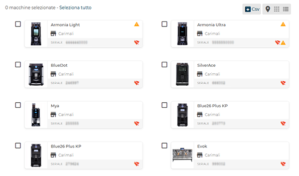</kbd>

---

### Vista mappa

Mostra la distribuzione geografica delle macchine all’interno di una mappa interattiva.

Ogni macchina è rappresentata da un indicatore (marker) differenziato in base allo stato operativo:

* 🟢 **Online** – Macchina connessa e operativa  
* 🔴 **Error** – Presenza di errori o anomalie  
* 🟡 **Warning** – Stato di attenzione  
* 🔵 **Refill** – Necessità di rifornimento  
* ⚪ **Offline** – Macchina non connessa  

La mappa supporta:

* Zoom e navigazione geografica
* Visualizzazione globale o locale
* Selezione del marker per accesso rapido alle informazioni

<kbd>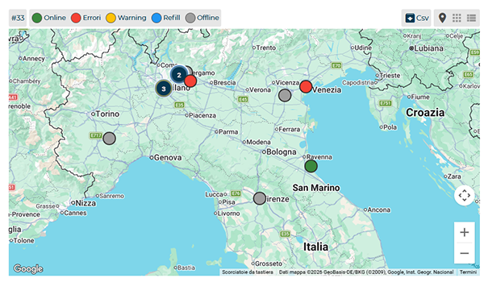</kbd>

---

Le modalità possono essere selezionate tramite i pulsanti **Elenco**, **Griglia** o **Mappa** presenti in alto a destra.  
Su dispositivi **smartphone**, la visualizzazione predefinita è **a elenco**.

Ogni riga o scheda rappresenta una singola macchina.  
La colonna **Sel.** consente la selezione multipla per operazioni collettive.

Il pulsante **CSV** permette di esportare l’elenco visualizzato.

---

## Indicatori di stato

Ogni macchina può presentare indicatori visivi che descrivono lo stato operativo.

  
Consente di accedere alla [scheda panoramica](docs-it/machine.md) della macchina.

Da questa sezione è possibile visualizzare:

### MANUTENZIONE

<kbd>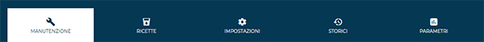</kbd>

* Stato generale
* Erogazioni recenti
* Temperature di esercizio
* Contatori
* Cicli di lavaggio
* Parametri di calibrazione
* Posizione geografica
* Manutenzioni programmate
* Cicli gruppo caffè
* Erogazioni ultime 24h
* Consumo prodotti
* Stato connessione

---

### RICETTE

<kbd>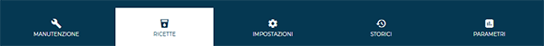</kbd>

* Import set ricette
* Visualizzazione elenco o griglia

---

### IMPOSTAZIONI

<kbd>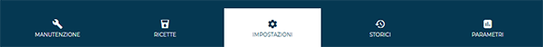</kbd>

* Configurazione macchina
* Firmware
* Lingua
* Sistema di pagamento
* Timezone
* Brewer
* Consumi
* Pianificazione manutenzione
* Gestione contatori

---

### STORICI

<kbd>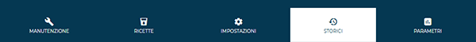</kbd>

* Storico errori
* Storico lavaggi
* Storico aggiornamenti firmware

---

### PARAMETRI

(disponibile per modelli SilverAce e firmware aggiornati)

<kbd>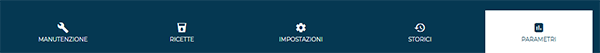</kbd>

* Orologio
* Pulizie e manutenzioni
* Display
* Parametri macchina

---

  
Indica la presenza di anomalie.

Tipologie principali:

* **Contatori non validi** – Erogazioni effettuate con macchina offline da oltre tre giorni.

  <kbd>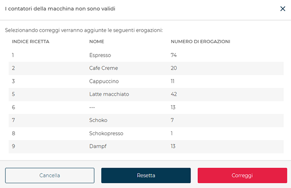</kbd>

  Azioni disponibili:
  * **Resetta**
  * **Correggi**

* **Anomalia comunicazione server** – Connessione instabile.

  <kbd>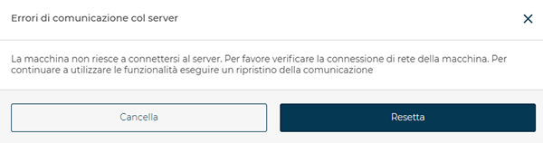</kbd>

  Azione disponibile:
  * **Resetta**

---

## Azioni sulle macchine

Selezionando una o più macchine, nella parte inferiore compare la sezione operativa.

<kbd>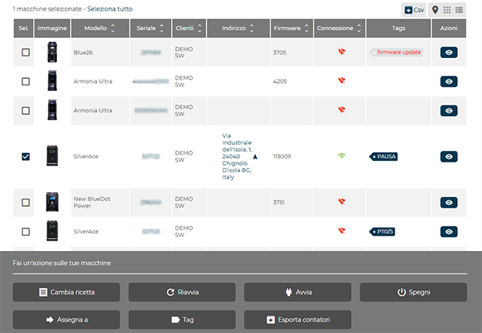</kbd>

Funzioni disponibili:

* **Cambia ricetta** – Aggiorna le ricette (max 10 macchine, stesso modello).
* **Aggiorna firmware** – Disponibile con tag *Firmware update*.
* **Riavvia** – Riavvio remoto.
* **Avvia** – Accensione macchina.
* **Spegni** – Spegnimento remoto.
* **Assegna a** – Associazione a cliente.
* **Tag** – Gestione tag.
* **Esporta contatori** – Esportazione CSV.

Le operazioni vengono applicate esclusivamente alle macchine selezionate.