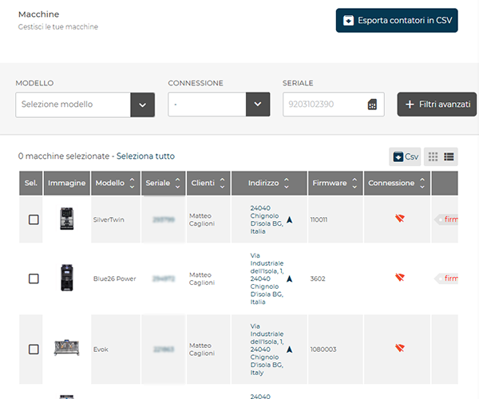
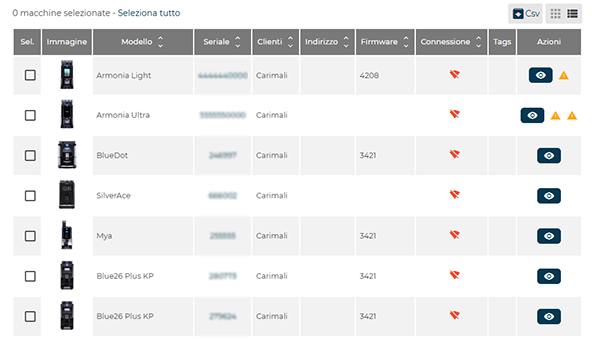
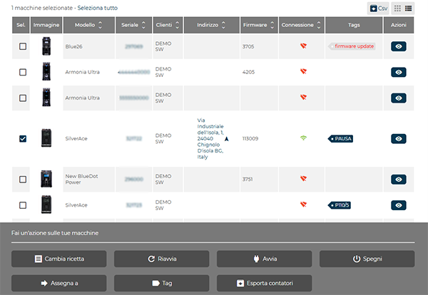

# Macchine

La sezione **Macchine** consente la visualizzazione, la ricerca e la gestione delle macchine da caffè connesse alla piattaforma **CARIcare**.
Da quest’area è possibile filtrare le macchine in base a diversi parametri, esportare i contatori, aggiornare il firmware, gestire le ricette o inviare comandi remoti.

<kbd></kbd>

---

## Esporta contatori in CSV

Il pulsante Esporta contatori in CSV genera un file in formato CSV (Comma-Separated Values) contenente i dati dei contatori aggiornati delle macchine elencate.
Il file prodotto può essere utilizzato per attività di analisi, statistiche o archiviazione dei dati di erogazione.

<kbd></kbd>

## Filtri di ricerca

La parte superiore della schermata contiene un insieme di **filtri** che permettono di individuare rapidamente una o più macchine in base a criteri specifici.

I campi disponibili sono:

* **Modello** – Filtra le macchine in base al modello di appartenenza.
* **Connessione** – Permette di selezionare solo le macchine *connesse* o *disconnesse*.
* **Seriale** – Ricerca diretta per numero seriale univoco.

Il pulsante **Filtri avanzati** consente di espandere o ridurre la visualizzazione dei criteri di ricerca.

* **Cliente** – Mostra le macchine assegnate a un determinato cliente.
* **Indirizzo** – Consente la ricerca per località o ubicazione della macchina.
* **Firmware** – Filtra in base alla versione firmware installata.
* **Tags** – Permette la selezione delle macchine in base ai tag assegnati
 (es. selezionando **Firmware update** – vengono filtrate le macchine per le quali è disponibile un aggiornamento software).

<kbd></kbd>

---

## Elenco macchine

La parte inferiore della pagina mostra la **lista delle macchine** con i principali dati operativi, visualizzabile in due modalità differenti:

* **Vista a elenco**
  Mostra le macchine in formato tabellare, disposte una per riga.
  Ogni voce contiene:

  * **Immagine**
  * **Modello**
  * **Seriale**
  * **Cliente**
  * **Indirizzo di installazione**
  * **Versione firmware** installata
  * **Stato della connessione**
  * **Tags**
  * **Azioni**

  <kbd></kbd>

* **Vista a griglia**
  Mostra le macchine in formato scheda, con le stesse informazioni principali in un layout più compatto.
  Questa modalità consente un riconoscimento visivo più rapido grazie all’immagine del modello.

  <kbd></kbd>

Le due modalità possono essere alternate tramite i pulsanti **Elenco** o **Griglia** presenti in alto a destra.
Sui dispositivi **smartphone**, la visualizzazione predefinita è **a elenco**, ottimizzata per la dimensione dello schermo.

Ogni riga o scheda rappresenta una singola macchina.
La colonna **Sel.** o la casella di selezione accanto a ciascuna macchina consente la **selezione multipla** per applicare azioni collettive.
Il pulsante **CSV**, posto in alto a destra, permette di **esportare l’elenco visualizzato** in formato **.csv**.

---

### Indicatori di stato

Ogni macchina può presentare **icone o indicatori visivi** che forniscono informazioni sullo stato operativo:

 Consente di [accedere alla scheda panoramica](docs-it/machine.md) della macchina selezionata.
  
  Da questa scheda è possibile visualizzare in tempo reale:

  * **MANUTENZIONE**

  <kbd></kbd>

      * **Stato generale della macchina**
      * **Erogazioni recenti**
      * **Temperature di esercizio (caffè e vapore)**
      * **Contatori globali e parziali**
      * **Cicli di lavaggio**
      * **Parametri di calibrazione**
      * **Posizione geografica**
      * **Manutenzione trimestrale / annuale**
      * **Numero cicli gruppo caffè**
      * **Erogazioni nelle ultime 24 ore**
      * **Consumo prodotti** ove disponibile
      * **Stato connessione**

* **RICETTE**

  <kbd></kbd>

    * **Importare un set di ricette**
    * **Ricette** vista a elenco / vista a griglia

* **IMPOSTAZIONI**

  <kbd></kbd>

    * **Configurazione della macchina**
    * **Firmware**
    * **Lingua**
    * **Sistema di pagamento**
    * **Timezone**
    * **Brewer**
    * **Consumo prodotti**
    * **Data prevista per la manutenzione straordinaria**
    * **Azzeramento e aggiornamento dei contatori**
* **STORICI**

  <kbd></kbd>

    * Storico **errori**
    * Storico **lavaggi**
    * Storico **aggiornamenti firmware**

* **PARAMETRI** (solo per modelli SilverAce e firmware di ultima versione)

  <kbd></kbd>

    * **Gestione orologio**
    * **Pulizie e manutenzioni**
    * **Opzioni display**
    * **Parametri macchina**

 Indica la presenza di una o più **anomalie associate alla macchina**.

  * **contatori non validi**: numero di erogazioni eseguite a macchina disconessa da più di tre giorni.

    <kbd></kbd>

    Premere *Resetta* per azzerare il conteggio delle erogazioni oppure premere *Correggi* per aggiungere le erogazioni effettuate in modalità offline nello storico delle vendite.
  
  * **Anomalia di comunicazione col server**: la connessione con il server non è stabile.

    <kbd></kbd>

    Premere *Resetta* per eseguire un resettare l'anomalia.

---

## Azioni sulle macchine

Selezionando una o più matricole, nella parte inferiore della schermata compare la sezione **Fai un’azione sulle tue macchine**, che raccoglie tutte le funzioni operative applicabili. 

Quando vengono selezionate più macchine contemporaneamente, alcune funzioni non sono disponibili e risultano disabilitate:: *Ravvia*, *Avvia*, *Spegni*.

<kbd></kbd>

* **Cambia ricetta** – Consente di **aggiornare il set di ricette** per le macchine selezionate.
  L’operazione può essere eseguita su **più macchine contemporaneamente**(max. 10), a condizione che appartengano **allo stesso modello** e abbiano **la medesima configurazione**.
 

* **Aggiorna firmware** – Avvia la procedura di aggiornamento firmware per le macchine selezionate solo in presenza del tag *Firmware update*.

* **Riavvia** – Esegue un riavvio remoto della macchina.

* **Avvia** – Riattiva una macchina in stato di arresto.

* **Spegni** – Esegue lo spegnimento remoto.

* **Assegna a** – Associa una o più macchine a un cliente esistente.

* **Tag** – Assegna o modifica i tag associati.

* **Esporta contatori** – Genera un file **CSV** contenente i dati aggiornati dei contatori delle macchine selezionate.

Tutte le operazioni vengono applicate esclusivamente alle macchine selezionate nella lista.
