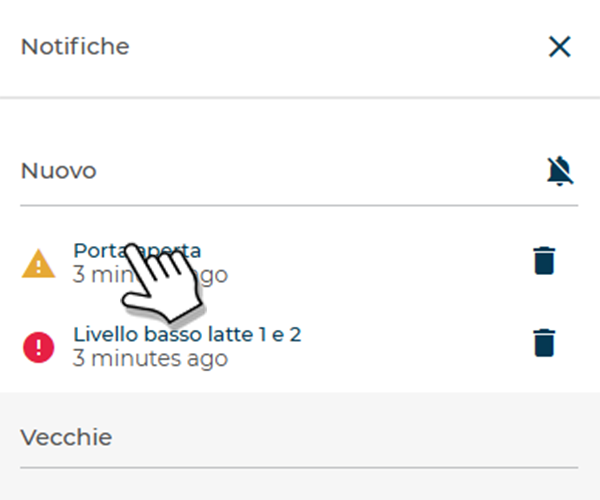

# Notifiche

In alto a destra della **Dashboard** è visibile l’icona a campanella con il **contatore** delle notifiche non lette.

<kbd></kbd>

Cliccando la campanella si apre il pannello **Notifiche**, suddiviso in **Nuovo** (non lette) e **Vecchie** (lette/archiviate).

<kbd></kbd>

## Cosa mostra

* **Tipo di segnalazione**: identificato da un’icona che rappresenta la natura dell’evento — *Errore*, *Warning*, *Refill*, *Macchina disconnessa* — oppure da un tag specifico come *Aggiornamento firmware*.
  Accanto all’icona è riportata anche la **descrizione della causa** dell’errore (ad esempio *Porta aperta* o *Livello basso latte*).

* **Dettaglio temporale**: sotto ogni segnalazione è indicato **quando** si è verificato l’evento, espresso in minuti, ore o giorni trascorsi.

## Azioni rapide

* **Aprire la notifica**: clic sul testo per andare direttamente alla sezione pertinente:

<kbd></kbd>

  * **PAGINA ERRORI** → l’elenco filtrato per tipo di errore.

  <kbd></kbd>

  * **PAGINA MACCHINA** → lista macchine con attivo tag di **aggiornamento firmware**.

    <kbd></kbd>

* **Icona cestino**: consente di spostare le notifiche dall’elenco **Nuove** all'elenco **Vecchie**. La notifica rimarrà visibile per 7 giorni, dopodiché verrà rimossa automaticamente.
* **Icona campanella barrata**: permette di spostare automaticamente tutte le notifiche presenti nella sezione **Nuove** in **Vecchie**.