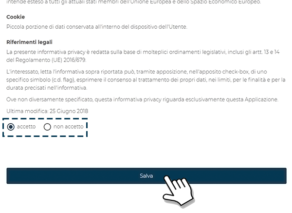

# Come accedere

Per raggiungere CARIcare apri il browser del tuo dispositivo nella barra degli indirizzi digita caricare.carimali.com o caricare.tech e conferma.

## Autenticazione

Una volta digitato caricare.carimali.com o caricare.tech nella barra degli indirizzi ti trovi sulla pagina di **Login**.
Nelle apposite caselle inserisci **nome utente** (1) e **password** (2), successivamente premi **Log in** (3), è possibile memorizzare la password  spuntando il riquadro **Remember me** (4), se la non ricordi la password [clicca quì](https://carimali.github.io/wiki/#/docs-it/recover-password).

## Policy di utilizzo e Privacy dei dati

Al primo accesso devi necessariamente accettare **Privacy Policy** e **Cookie Policy** di CARICare, questo passaggio obbligatorio serve a garantire la riservatezza delle informazioni e a tutelare l’utilizzatore secondo le norme vigenti, non farlo renderà impossibile utilizzare qualsiasi funzionalità dell’applicazione, opzionalmente potete iscrivervi alla newsletter Carimali per rimanere sempre aggiornati sulle novità Carimali e CARIcare.

Premi **accetto** per aderire alle *Privacy Policy di CARICare* (1)

Premi **accetto** per aderire alle *Cookie Policy di CARICare* (2) e successivamente premi **Salva** (3) per momerizzare le tue scelte

N.B. in qualsiasi momento puoi modificare le tue preferenze su policy & privacy dal tuo profilo, tuttavia rifiutarne anche solo una tra **Privacy Policy di CARICare** o **Cookie Policy di CARICare** riporterà il vostro account nella condizione di non poter utilizzare qualsiasi funzionalità di CARIcare.

