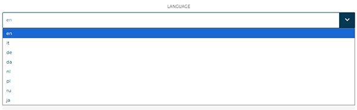
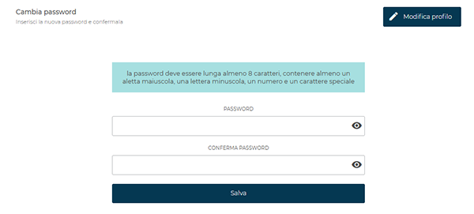
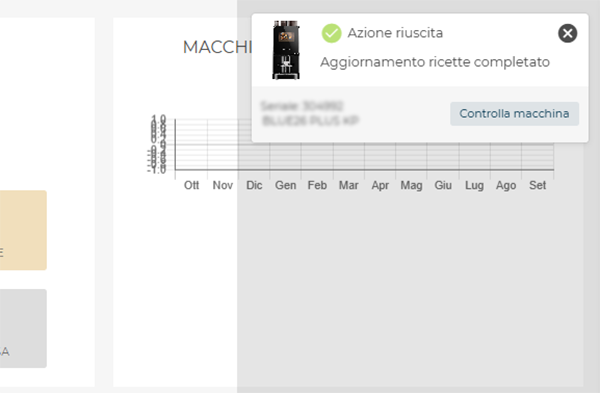

# Profilo

<kbd></kbd>

All’interno della scheda personale sono disponibili le seguenti funzioni:

## **Modifica profilo** 

Consente di aggiornare i dati personali e modificare la password di accesso. 

<kbd></kbd>

La sezione permette di:

* Aggiornare:
    * **Nome**
    * **Cognome**
    * **Email**
    * **Lingua** – selezionabile dal menu a discesa per impostare la lingua dell’interfaccia.

<kbd></kbd>

* Cambiare la password corrente 

<kbd></kbd>

La nuova password deve rispettare i seguenti requisiti:

* minimo **8 caratteri**;
* almeno **una lettera maiuscola**;
* almeno **una lettera minuscola**;
* almeno **un numero**;
* almeno **un carattere speciale**.

Inserire la nuova password nei due campi dedicati (**Password** e **Conferma password**) e premere **Salva** per confermare le modifiche.
Il pulsante **Modifica profilo** consente di tornare alla schermata principale di configurazione.

* Configurare le notifiche

La sezione consente di configurare le notifiche relative agli eventi di sistema.
Per ciascun tipo di notifica sono indicati i canali disponibili: **Email**, **Notifiche** e **Popup**.

| Tipo di notifica    | Descrizione                                                               | Email | Notifiche | Popup |
| ------------------- | ------------------------------------------------------------------------- | :---: | :-------: | :---: |
| **Error**           | Segnala la presenza di un errore (es. porta aperta, anomalia di sistema). |   📧  |     🔔    |  N/A  |
| **Warning**         | Avvisi di stato o situazioni non critiche.                                |   📧  |     🔔    |  N/A  |
| **Refill**          | Indica la necessità di rifornimenti o materiali di consumo.               |   📧  |     🔔    |  N/A  |
| **Disconnessione**  | Avvisa della perdita di connessione della macchina.                       |   📧  |     🔔    |  N/A  |
| **Firmware Update** | Comunica la disponibilità di aggiornamenti firmware.                      |   📧  |     🔔    |  N/A  |
| **Azioni macchina** | Segnala comandi o azioni automatiche.                                     |  N/A  |    N/A    |   💬  |

> **N/A** indica che la tipologia di notifica non è disponibile per quel canale.

Esempio notifica Popup:

<kbd></kbd>

Nella parte inferiore della pagina è visibile la [**API Key**](/docs-it/api) associata all’account, utilizzabile per integrazioni con sistemi esterni.
Per motivi di sicurezza, non deve essere condivisa con altri utenti.

## **Informativa sulla privacy** 

Apre la sezione dedicata alla consultazione e alla gestione dell’informativa sulla privacy.

## **Logout**

Consente di terminare la sessione in corso e disconnettersi dal proprio account.