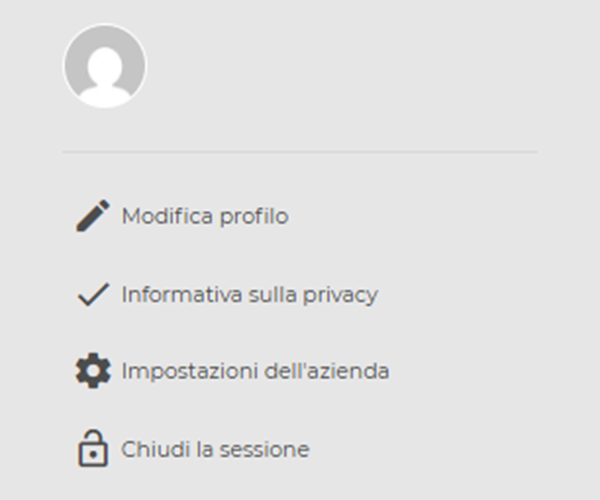

# Profilo

## Impostazioni Profilo Personale

Cliccando sul bottone con tre linee orizzontali puoi accedere al tuo profilo personale.

<kbd></kbd>

Nella tua scheda personale scegli il link "**Modifica Profilo**"".

<kbd></kbd>

All'interno della pagina di modifica del profilo, puoi aggiornare i tuoi dati compilando i campi **"nome"**, **"cognome"**, **"email"** o **scegliere la lingua** con la quale sarà visualizzata l'intera piattaforma.

<kbd></kbd>

Oltre a questo, puoi scegliere quali notifiche ricevere in base alla tipologia di allarme, spuntando la casella corrispondente.

<kbd></kbd>

## Modifica impostazioni Azienda

Scegli il link "**Modifica Impostazioni Azienda**"" puoi assegnare il **supporto utente** selezionandolo dal menù a discesa.

<kbd></kbd>

<kbd></kbd>

Ricordati di premere "Salva" per memorizzare tutte le modifiche apportate.

